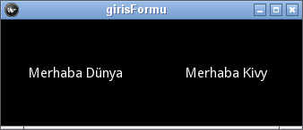
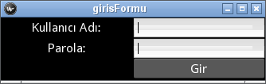
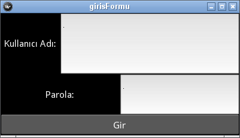

.. _kivyDili:

#########################################
:index:`Kivy Dili`: kv (:index:`kv lang`)
#########################################

Kivy pencere düzenlerini oluşturmak için muhteşem bir dil sunmaktadır: ``kv`` Dili. Bu dili biraz HTML'ye biraz da css'ye benzetebilirsiniz. Bu bölümde ``kv`` dilini anlatmaya çalışacağız.

"Merhaba Dünya" yeniden
=======================
:ref:`merhabaDunya` programında ekrandaki "Merhaba Dünya" yazısını program kodu içerisinde bir etiket oluşturup, bu etiketin metinini değiştirerek yapmıştık. Bu etiketi daha sonra düzen olarak geri döndürmüştük
(``return Label()``). Şimdi aynı pencereyi ``kv`` dilini kullanrak yapacağız. Önce program kodumuzu :ref:`main1`'deki gibi yazalım.
Bu kodda hiçbir değişiklik yapmadan birçok pencere oluşturacağız. 

.. literalinclude:: ./programlar/kivyDili/1/main.py
    :linenos:
    :caption: main.py
    :name: main1
    :language: python
    

Gördüğünüz gibi bu program hiçbirşey döndürmüyor. Sadece basit bir pencere oluşturuyor. Pencere içeriğini ``kv`` dili oluşturacağız.
Şimdi dosyasını :ref:`girisformu1` programını kaydettiğiniz aynı dizinine (klasöre) kaydedin.

.. literalinclude:: ./programlar/kivyDili/1/girisformu0.kv
    :linenos:
    :caption: girisformu.kv
    :name: girisformu1
    
Bu dosyanın adı, python programının dosya adı değil, uygulamanın adı ile aynı olacaktır. 
Eğer uygulamanızın adı ``kullaniciGirisFormu()`` ise ``kv`` dosyasının adı ``kullanicigirisformu.kv`` olacaktır.
Dosya adında küçük harfleri kullanmanızı yeğlerim. Buradaki :ref:`girisformu1` oldukça basit bir yapıya sahip.Sadece iki satırdan ibaret
ilk satır pencerede bir etiketin olacağı (Label), ikinci satırda ise bu etiketin üzerinde yazacak metni (text) belirtmektedir. Tıpkı Python'da
olduğu gibi ``kv`` dilinde de girintiler (indendation) önemlidir. Birinci satır penceredeki grafik parçacığının ismini belirtmektedir.
Grafik parçacığının isminden sonra iki nokta üst üste konulup sonraki satırda (sanki işlev tanımlar gibi), bu grafik parçacığının özelliklerine ait
yapılanmayı biraz içerde başlatıyoruz. 

:ref:`main1` programını çalıştırdığınızda yine :numref:`Şekil %s <merhabaDunyaImg>`'deki gibi bir pencere açılacaktır.

:index:`Kutu Pencere Düzeni` (:index:`Box Layout`)
=====================================================

:ref:`merhabaDunyaBolumu` bölümündeki :ref:`merhabaDunyaPencereDuzenleri`'ni hatırlayın. Orada ızgara pencere düzenini oluşturmak için
``GridLayout()`` sınıfını kullanmıştık. ``kv`` dilinde de yine grafik parcacıklarının ismini kullanacağız. Kutu pencere düzeni ``BoxGridLayout()``
sınıfı ile oluşturulur. O halde ``kv`` dilinde ``BoxLayout`` ile kutu pencere düzenini oluşturabiliriz. :numref:`Liste %s <girisformu2>`'deki gibi değiştirin.

.. literalinclude:: ./programlar/kivyDili/2/girisformu.kv
    :linenos:
    :caption: girisformu.kv
    :name: girisformu2

:ref:`main1` programını tekrar çalıştırdığımızda :numref:`Şekil %s <girisformu2Img>`'deki gibi bir pencere açılacaktır.

.. _girisformu2Img:

   Kutu Pencere Düzeni
   
Bu pencerede yan yana iki tane etiketin oluştuğunu görüyorsunuz. Kutu pencere düzeninin ön tanımlı yönelimi "yatay"dır (vertical).
Eğer dikey olarak yönelndirmek istiyorsanız, pencere düzeninine `orientation: 'vertical'` satırını :numref:`Liste %s <girisformu3>`'deki gibi
eklemelisiniz.

.. literalinclude:: ./programlar/kivyDili/2/girisformu1.kv
    :linenos:
    :caption: girisformu.kv
    :name: girisformu3

Şimdi :numref:`Şekil %s <girisformu3Img>`'deki gibi etiketlerimiz dikey olarak yerleşecektir.

.. _girisformu3Img:

.. figure:: ./resimler/girisformu3Img.png

   Kutu Pencere Düzeni: Dikey Yönelimli
 

:index:`Izgara Pencere Düzeni` (:index:`Grid Layout`)
=====================================================

Izgara pencere düzenini dah önce görmüştük. Sütun ve satırlardan oluşuyordu. Şimdi Izgara Pencere düzenini ``kv`` dili oluşturacağız. ``girisformu.kv``
programını :numref:`Liste %s <girisformu4>`'deki gibi yazın. Metin kutularının ``TerxtInput`` ile oluşturulduğuna dikkat etmelisiniz.

.. literalinclude:: ./programlar/kivyDili/2/girisformu4.kv
    :linenos:
    :caption: girisformu.kv
    :name: girisformu4

Burada iki sütunlu olması için `cols: 2` satırını eklediğimize dikkat etmelisiniz. Yine aynı soruyu sormak istiyorum, 9. satırdaki `Widget`
garfik parçacığını niçin koymuş olabiliriz? :ref:`main1` programını çalıştırdığınızda :numref:`Şekil %s <girisformu4Img>`'deki gibi görünecektir.

.. _girisformu4Img:

   Izgara Düzeni: Kullanıcı Giriş Formu
   
Aslında ızgara düzenini, kutu düzenlerini iç içe yazarakda yapabiliriz. Nihayetinde, ızgara düzeni dediğimiz, alt alta 
yerleştirilmiş (dikey yönelimli), yatay yönelimli kutulardan oluşmaktadır. :numref:`Liste %s <girisformu5>`'yi inceleyin.

.. literalinclude:: ./programlar/kivyDili/2/girisformu5.kv
    :linenos:
    :caption: girisformu.kv
    :name: girisformu5

Burada gördüğünüz gibi, en üstte bir tane dikey yönelimli kutu pencere düzeni ve bunun altında üç tane yatay yönelimli kutu pencere düzeni
yerleştirmiş olduk. İşimizi biraz uzattık, ancak konuyu anlamanız açısından bu örneği verdik. 
:numref:`Liste %s <girisformu5>` ve :numref:`Liste %s <girisformu4>` aynı görünütüyü oluşturur. Python programını (burada ``main.py``)
hiç değiştirmeden birçok ``kv`` dosyası ile kullandık ve serferinde farklı pencereler elde ettik. 
:numref:`Liste %s <girisformu5>`'deki 12. satırı (``Widget:`` yazan satır) silersek, nasıl bir değişiklik oluşur? Bunu denemelisiniz.

:index:`Parçacık Boyutları` (:index:`size_hint`)
================================================

Grafik parçacıklarının görünür boyutlarını ``size_hint_x`` ve ``size_hint_y`` ayarlayabilirsiniz. Anlayacağınız üzere,
``size_hint_x`` yatay boyutun, ``size_hint_y`` ise dikey boyutun büyüklüğünü ayarlar. Ayarlamalar oran olarak yapılır. Örneğin
yatay olarak yerleştirilmiş iki parcacıktan birisinin boyutu 1, diğerinin 4 ise, toplamı 5 yapacağından, ilk parcacık yatayın %20 sini,
diğeri %80'nin kaplayacaktır. 3:2 olduğunda ne olabilir? İster yatay, ister dikey olsun birisine boyut bildirdiğinizde, diğerlerinede
bildirmek durumundasınız. Aksi halde anlamsız olacaktır.

``girisformu.kv`` dosyasını  :numref:`Liste %s <girisformu4>`'deki gibi düzenleyelim.

.. literalinclude:: ./programlar/kivyDili/2/girisformu6.kv
    :linenos:
    :caption: girisformu.kv
    :name: girisformu6

Bunun üzerinde biraz konuşalım. Gördüğünüz gibi üç satır var. Her bir satır bir yatay kutu pencere düzeni tarafından oluşturulmakta,
satırlar ise en üstteki dikey pencere kutusu ile alt alta getiriliyor. Üç adet satırın yükseklikleri sırası ile 
``size_hint_y: 3``, ``size_hint_y: 2`` ve ``size_hint_y: 1`` ile ayarlanmıştır (1., 2. ve 3. satırları oluşturan yatay kutular). 
Bunun anlamı dikey boyutun yarısı 1. yatay kutu tarafından kaplanacaktır. Geri kalan yarısının %66.6'sı 2. yatay kutu ve %33.3'ü ise
3. yatay kutu tarafından kaplanacaktır. Yatay büyüklük ise sadece 1. yatay kutu için ayarlanmıştır. %25'i etiket tarafından 
(``Kullanıcı Adı`` etiketi), %75'i ise metin kutusu tarafından kullanılacaktır. Programımızı çalıştırdığımızda 
:numref:`Şekil %s <girisformu4Img>`'deki gibi görünecektir.

.. _girisformu5Img:

   Boyutlandırılmış Giriş Formu

``kv`` dili ile pencereleri oluşturmayı öğrencidiğimize göre, şimdi biraz bu pencereleri işler hale getirmeye geldi. Sonraki bölümde
garfik parçacıkları ile kullanıcı etkileşmesinin nasıl gerçekleştiğini göreceğiz. 
