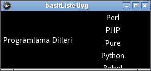
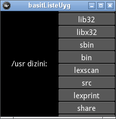
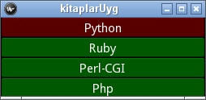
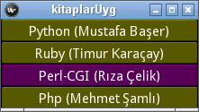
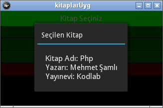
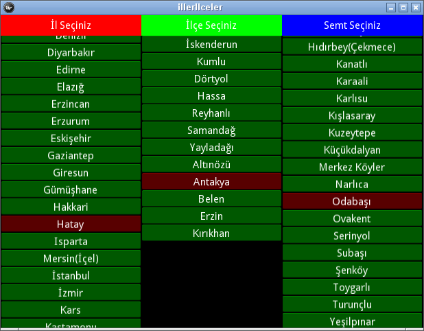
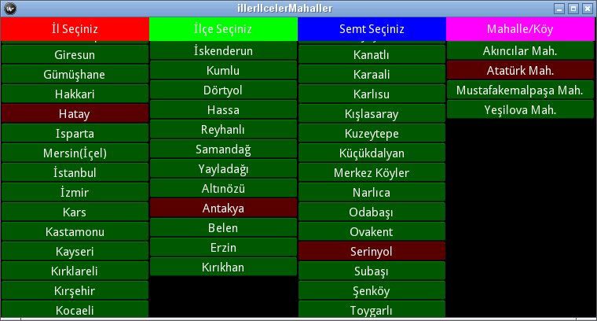
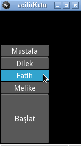

.. _listeEylemCubuguBolumu:

################################
Liste Görünümü ve Eylem Çubuğu
################################

.. warning::
   
   Bu bölüm tamamlanmamıştır. Zaman buldukça yazıyorum.

Bu bölümde Liste Görünümünü, Açılır Kutu (DropDown) ve Eylem Çubuğu'nu anlatacağız. Konuları anlatırken daha önce
geliştirdiğimiz uygulamalara eklentiler yaparak uygulamasını da göstereceğiz.

Liste Görünümü
===============
Kivy'de listeler ve ilgili görünümler (adaptör, uyarlayıcı kullanarak), daha önce kullandığım GUI (GKA)'lardan biraz farklı
çalışıyor. Bu farklılık listelerin kullanımınız biraz zorşaltırmış gibi görünse de, bu ona listelerin daha esnek ve kullanışlı
olmasını sağlıyor. İlk olarak basit bir liste oluşturalım. Bu liste sadece verileri görüntülemek için kullanılacak, seçim
yapılamayacak ve herhangi bir eylem tanımlanamayacaktır. Bir liste oluşturmak için  :index:`ListView` nesnesini kullanırız.
``ListView`` nesnesinin en basit kullanımı paramtere olarak :index:`item_strings` vermektir. Bu parametre Python
listesi helinde listelenecek olan elemanları alır. Programlamada dillerini listeleyecek bir programı 
:numref:`listeGorunumu`'deki gibi yazabiliriz.

.. literalinclude:: ./programlar/listeEylem/programlar/1/listeGorunumu.py
    :linenos:
    :tab-width: 4
    :caption: listeGorunumu.py
    :name: listeGorunumu
    :language: python

Programı çalıştırdığımızda :numref:`Şekil %s <basitListe1Img>`'de görünen pencere açılacaktır.

.. _basitListe1Img:

   Liste Görünümü (Temel)

SimpleListAdapter Adaptörü Kullanımı
-------------------------------------
Liste görünümlerini değiştirmek ve işerliğe kavuşturmak için ``ListView`` nesnesine bir adaptör vermektir.
Bu adaptörlerden en basiti ise :index:`SimpleListAdapter` nesnesidir. Bu adaptör sadece listelemek için kullanılır. Programlama dillerininin isismlerini
gösteren programı bu adaptörü kullanarak tekrar yazmak istersek: :numref:`basitListe`'deki gibi ``basitListe.py``
dosyasını  hazırlamamız gerekcek.

.. literalinclude:: ./programlar/listeEylem/programlar/1/basitListe.py
    :linenos:
    :tab-width: 4
    :caption: basitListe.py
    :name: basitListe
    :language: python
    
Şimdi bu programı açıklamaya çalışalım. Programda 14. satırdaki ``programlama_dilleri`` listesi basit bir Python listesidir.
Görüntülemek istediğimiz elemanları bu listeye yazabiliriz. Liste yerine tüp (tuple) kullanabilirsiniz. Liste görünümünde
kullanabileceğimiz en basit adaptörün ``SimpleListAdapter`` olduğunu söylemiştik. Bu adaptör sadece bir dizi elemanı
ekranda görüntülemek için kullanılabilir. Herhangi bir seçim ya da eylem gerçekleştiremezsiniz. Kullanımı oldukça basittir:
paramatere olarak :index:`data` (listelenecek elemanlar) ve :index:`cls` (görüntüleme biçimi) alır. Görüntüleme
biçimi basit olarak bir etiket (Label) ya da düğme (Button) olabilir. Biz yukarıda etiket (Label) kullandık. 
İsterseniz aynı programı düpme (Button) ile tekrar çalıştırın. Program çalıştığında  yine
:numref:`Şekil %s <basitListe1Img>`'de görünen pencere açılacaktır.

   
:numref:`Şekil %s <basitListe2Img>`'de resimde aynı programın, listedeki görüntüleme biçiminin (``cls=Button``) düğme (Button) hali
görünmektedir.

.. _basitListe2Img:

.. figure:: ./programlar/listeEylem/programlar/1/basitListe2.png

   Basit Liste (Düğme)

:numref:`basitListe`'deki programı, ``c:\windows`` (Linux için ``/usr``) klasöründeki dosya ve dizinleri
gösterecek şekilde uyarlayınız. Linux için programınızın çalışmış hali :numref:`Şekil %s <basitListe-klasorImg>`'deki gibi olacaktır.

.. _basitListe-klasorImg:

   Dosya ve Klasörlerin Listelenmesi (Linux)

Çözüm:

basitListe-klasorler.py:       https://github.com/mbaser/kivy-tr/blob/master/docs/programlar/listeEylem/programlar/1/basitListe-klasorler.py

Sonraki konuya geçmeden önce listelerin ``kv`` dili ile nasıl hazırlanacağına bakalım. :numref:`basitListe`'deki programımızın
aynısını ``kv`` dili ile yazalım. Önce Python programını :numref:`basitListeKv`'deki gibi yazalım

.. literalinclude:: ./programlar/listeEylem/programlar/1/basitListeKv.py
    :linenos:
    :tab-width: 4
    :caption:  basitListeKv.py
    :name: basitListeKv
    :language: python

Sanırım bu program çok kolay oldu ve herhangi bir açıklamaya ihtiyacı yok. Bu program tarafından kullanılacak ``kv``
dosyasını :numref:`basitListeKv_kv`'de görüldüğü gibi yazabiliriz.

.. literalinclude:: ./programlar/listeEylem/programlar/1/basitlisteuyg.kv
    :linenos:
    :tab-width: 4
    :caption:  basitlisteuyg.kv
    :name: basitListeKv_kv

Bu ``kv`` dosyasının ilk iki stırında ``Label`` ve  ``SimpleListAdapter`` nesnelerini ilgili modüllerden nasıl içerdiğimizi
iyice inceleyiniz. Program içerisinden adaptöre ve adaptörün verilerine ulaşabilir, güncelleyebilirsiniz ve hatta başka adaptör
kullanabilirsiniz. Aşağıdaki kodu ``build()`` işlevinin altına yazarsanız, programlama dilleri listesine "Pascal", "C" ve "C++" nin de
eklendiğini göreceksiniz:

::

        for pr in ["Pascal", "C", "C++"]:
            self.root.ids.listeci.adapter.data.append(pr)

ListAdapter Adaptörü Kullanımı
-------------------------------
Listeler genellikle arasından birisni seçmek için kullanılır ve daha önce anlatılan basit liste görünümü oluşturmaktan 
daha karmaşık veriye sahip olabilir. Bunları ``ListAdapter`` veya ``DictAdapter`` adaptörlerini kullanarak yapabiliriz.
Burada sadece ``ListAdapter`` anlatılacaktır.

Önce :index:`ListAdapter` kullanımına bakalım. Daha önce söyledğimiz gibi ``ListView`` parçacığında adaptörler, veriyi
içerir. Bu veri ``ListAdapter`` için her biri birer sözlük olan Python Listesidir. Örneğin kitaplara ait veriyi ele alalım
(*not: kitaplar rastgele seçilmiştir, seçimde herhangi bir tercih yoktur*)::

    kitaplar=[ {'adi':'Python', 'yazari':'Mustafa Başer', 'yayinevi':'Dikeyeksen'},
               {'adi':'Ruby', 'yazari':'Timur Karaçay', 'yayinevi':'Seçkin'},
               {'adi':'Perl-CGI', 'yazari':'Rıza Çelik', 'yayinevi':'Seçkin'},
               {'adi':'Php', 'yazari':'Mehmet Şamlı', 'yayinevi':'Kodlab'} ]

Burada ``kitaplar`` bildiğimiz bir Python listesi ve elemanları bildiğimiz Python sözlükleridir. Her sözlük 
``adi``, ``yazarı`` ve ``yayinevi`` anahtarları ile bunlara ait birer değer içermektedir. ``kitaplar`` listesini
olduğu gibi ``Listadapter`` nesnesine veri seti olarak atayabiliriz. Peki kullanıcıya ne gösterilecek? Bunu ise bir
işlev yadımı ile belirleyebiliriz. Bu işeve :index:`argüman çevirici` (:index:`arg_converter`) diyoruz. Argüman çevirici
kendisine gelen veriyi, listede gösterilecek şekilde düzenler ve yine bir sözlük döndürür. Bu sözlükte bulunması gereken
tek zorunlu anahtar ``text`` dir. Bu anahtarın değeri kullanıcıya listede gösterilen metindir. İsterseniz gösterilecek olan liste
elemanı (burada :index:`ListItemButton` olacaktır) (liste düğmesi) ile ilgili görünümü değiştirebilirsiniz; örneğin boyutunu.

Şimdi bunları birleştirelim ve seçilebilir bir liste oluşturalım. Programımızı :numref:`kitaplar`'deki gibi yazalım

.. literalinclude:: ./programlar/listeEylem/programlar/2/kitaplar.py
    :linenos:
    :tab-width: 4
    :caption:  kitaplar.py
    :name: kitaplar
    :language: python

Programımızı çalıştıracak olursak :numref:`Şekil %s <listAdaptor1Img>`'deki gibi bir pencere açılacaktır.

.. _listAdaptor1Img:

   Seçilebilir Kitap Listesi
   
``ListAdapter`` nesnesi ``arg_converter`` işlevine (burada ``argumanCevirici``) iki adet argüman gönderir. Bunlardan
ilki gönderilen verinin veri setindeki (``data`` parametresine atanan değer, burada ``kitaplar`` listesi) konumu (indeksi)
ikincisi ise, verinin kendisi. ``kitaplar`` listesinin her elemanı sıra ile bu işleve gönderilir. Bu işev yine bir
sözlük döndürür. Sözlük en az ``text`` anahtarına sahip olmalıdır. ``text`` anahtarının değeri kullanıcıya gösterilen metindir.
:numref:`kitaplar`'daki  programda ``size_hint_y`` ve ``height`` anhatarlarını kullanarak listedeki düğmenin 
(``ListItemButton``) boytunu 25 piksel yaptık. ``ListItemButton`` nesnesi ile oluşturulan düğmelerin seçilmiş ve seçilmemiş
olanların rengini de değiştirebilirsiniz. Bunları :index:`deselected_color` ve :index:`selected_color` anahtarları ile yapabilirsiniz.
Örneğin :numref:`kitaplar`'daki  programda ``argumanCevirici()`` işlevini aşağıdaki gibi yazarsanız, seçilmiş olan düğme rengi
mor, seçilmemiş olan düğmelerin rengi ise sarı olacaktır::

    def argumanCevirici(self, satir, nesne):
        return {'text': nesne["adi"], 
               'size_hint_y': None, 'height': 25,
               'deselected_color': [1,1,0,1],
               'selected_color': [1,0,1,1]
               } 

Eğer kullanıcıya görüntülenecek olan düğme üzerindeki metinde, sadece kitap adı yerine yazarının da görünmesini istiyorsanız, 
``argumanCevirici()`` işlevini şu şekilde değiştirebilirsiniz::

    def argumanCevirici(self, satir, nesne):
        return {'text': '%s (%s)' % (nesne["adi"], nesne['yazari']),
               'size_hint_y': None, 'height': 25,
               'deselected_color': [1,1,0,1],
               'selected_color': [1,0,1,1]
               } 

Programımızı bu işlev ile çalıştıracak olursak :numref:`Şekil %s <listAdaptor2Img>`'deki gibi bir pencere açılacaktır.

.. _listAdaptor2Img:

   Değiştirilmiş Kitap Listesi

``argumanCevirici()`` işlevi sadece iki argüman alır ve bir sözlük dündürür. Bu tür bir işelev ihityacınız var ise bunu 
Python'nun muhteşem ``lambda`` ifadesi ile gerçekleştirebilirsiniz. ``lambda`` ifadesi kendisine gelen argümanları birer
parametreye aktarır ve bu parametreleri kullanarak bir sonuç döndürme işlevi sağlar. Örneğin kendisine gelen sayıları
toplayan bir işleve ihtiyacımız var ise::

    def topla(a,b):
        return a+b
        
yerine::

    >>> topla=lambda a,b: a+b
    >>> topla(5,7)
    12

şeklinde yazabiliriz. Bu bilgiler ışığında ``argumanCevirici()`` işlevini hiç yazmadan ``arg_cvonverter`` parametresine
aşağıdaki gibi ``lambda`` ifadesini yazabiliriz::

    liste_adaptoru=ListAdapter(args_converter=lambda satir, nesne: {'text':nesne["adi"],'size_hint_y': None, 'height': 25},
                               data=kitaplar,
                               cls=ListItemButton,
                               allow_empty_selection=False)

``ListAdapter`` parçacığında anlatmadığımız :index:`allow_empty_selection` paramteresine ``False`` değerini verirseniz,
listede mutlaka bir seçim yapılmış olması gerekir. Bu durumda seçim yapılmamış ise, veri setinin ilk elemanı otomatik 
olarak seçili hale gelir. Eğer ``allow_empty_selection`` değerini ``True`` yaparsanız (ön tanımlı değeri budur), listede bir
seçim yapma zorunluluğu olmaz.

:numref:`kitaplar`'daki  programı ``kv`` dili ile yazalım. Önce ana programı :numref:`kitaplar-main`'daki gibi yazalım.

.. literalinclude:: ./programlar/listeEylem/programlar/2/main.py
    :linenos:
    :tab-width: 4
    :caption:  main.py
    :name: kitaplar-main
    :language: python

Sanırım bu programda herşey açık. ``kv`` dosyasını ise :numref:`kitaplar-kv`'daki gibi hazırladım:

.. literalinclude:: ./programlar/listeEylem/programlar/2/kitaplaruyg.kv
    :linenos:
    :tab-width: 4
    :caption:  kitaplaruyg.kv
    :name: kitaplar-kv

Bu dosyayı inceleyecek olursanız, etikette ilk defa (11. satırda) ``canvas.before`` parametresini kullanmış olduk.
Ne yazıkki Kivy geliştiricileri bir etiketin arka plan rengini değiştirebilmemiz için bir parametre koymamış. Bunun
yerine parçacık çizilmeden önce tuvalin (canvas) arka planını boyamamız gerekir. Bunu da şu satırlar ile yapıyoruz::

    canvas.before:
        Color:
            rgba: [0, 1, 0, 1]
        Rectangle:
            pos: self.pos
            size: self.size

Seçimin Denetlenmesi
---------------------
En azından ``ListAdapter`` kullanılan liste görünümlerinde bir seçim yapıldığında, bir eylem gerçekleştirilmek isteniyorsa
adaptörün :index:`on_selection_change` olayına bir işlev bağlamak gerekir.  :numref:`kitaplar-main`'daki programda seçilen
seçilen kitaba ait ayrıntıları açılır pencerede görüntülemek üzere ``build()`` işlevinin en altına şu satırı ekleyelim::

    self.root.ids.kitaplar.adapter.bind(on_selection_change=self.secim)

Bir kitap seçildiğinde ``secim()`` işlevi çağrılacaktır. Bu işleve, adaptörün kendisi argüman olarak verilecektir.
Bir adaptörde seçilen maddeler ait ``ListItemButton``
nesneleri Python listesi halinde :index:`selection` özelliğinden alınabilir (unutmayın birden fazla seçime olanak 
sağlamak için adatörün 
:index:`selection_mode` parametresinin değerini ``multiple`` yapmalısınız). Seçilen maddelerin listedeki konumlarını ise
``ListItemButton`` nesnesinin ``index`` özelliği ile alabiliriz. O halde ``secim`` işlevini şu şekilde yazabiliriz::

    def secim(self, nesne):
        if nesne.selection:
            secimID=nesne.selection[0].index
            secilenKitap=nesne.data[secimID]

            icerik=Label(text='Kitap Adı: %s\nYazarı: %s\nYayınevi: %s' % (
                              secilenKitap['adi'],
                              secilenKitap['yazari'],
                              secilenKitap['yayinevi']))
        
            popup = Popup(title='Seçilen Kitap',
                          content=icerik,
                          size_hint=(None, None), size=(200, 150))

            icerik.bind(on_touch_down=popup.dismiss)
            popup.open()

Aşağıdaki satırları programınızın başına yazmayı unutmayın::

    from kivy.uix.popup import Popup
    from kivy.uix.label import Label

Şu halde programımızı çalıştırıp bir kitap seçtiğimizde, bir popup açılacak ve burada kitap detayları görüntülecektir 
(:numref:`Şekil %s <listAdaptor3Img>`).

.. _listAdaptor3Img:

   Kitap ayrıntılarının görüntülenmesi

İl-İlçe-Mahalle Seçimi
----------------------

Liste görünümü ile ilgili daha ayrıntılı bir örnek yapalım. Hemen birçok alışveriş sitesinde bulunduğunuz il ve ilçe
seçimi ile ilgili açılır listeler bulunur. Biz buna bir de mahalleyi ekleyeceğiz. Uygulamamız şöyle tasarlayalım:

1. Ana pencereyi dikey olarak üç parçaya bölelim. Bunun için 3 sütunlu bir ızgara pencere düzenine
   ihtiyacımız olacak.
2. Birinci sütunda illeri gösterelim. Buranın illeri gösterdiğini kullanıcıya bildirmek için etiketten
   bir başlık oluşturalım ve metnine "İl Seçiniz" yazalım. Etiketin altında liste görünümünde tüm illeri sıralayalım
3. İkinci sütunda ilçeleri gösterelim. Buranın ilçeleri gösterdiğini kullanıcıya bildirmek için etiketten
   bir başlık oluşturalım ve metnine "İlçe Seçiniz" yazalım. Birinci sütunda seçilen ile ait ilçeleri etiketin
   altında liste görünümünde sıralayalım.
4. Üçüncü sütunda semtleri gösterelim. Buranın semtleri gösterdiğini kullanıcıya bildirmek için etiketten
   bir başlık oluşturalım ve metnine "Semt Seçiniz" yazalım. İkinci sütunda seçilen ilçeye ait semtleri etiketin
   altında liste görünümünde sıralayalım.

Uygulamamazı yazmadan önce ülkemizin illeri, bu illerin ilçeleri ve her ilçenin semtlerinin listesi gerekli. Bunu teker 
teker elinizle yazabilirsiniz. Ya benim gibi da internette "İl-ilçe-Semt-Mahalle-PostaKodu" şeklinde aratırsanız, muhtemelen
birçok veritabanı bulacaksınız. Aramam sonucunda şu adreste:

http://daltinkurt.com/Yazi/227/Il-Ilce-Semt-Mahalle-Veritabanlari-ve-Uygulamasi.aspx

bir tane buldum. Orada birçok veritabanı biçiminde hazırlanmış biçimlerini mevcut. Ben xml biçimini kullanacağım.
Yerel kopyasını buradan edinebilirsiniz (bunun için Sn. Devrim Altınkurt'dan izin alınmıştır):

Il-ilce-Semt-Mahalle-PostaKodu.xml: https://raw.githubusercontent.com/mbaser/kivy-tr/master/docs/programlar/listeEylem/programlar/3/Il-ilce-Semt-Mahalle-PostaKodu.xml

``Il-ilce-Semt-Mahalle-PostaKodu.xml`` dosyası oldukça büyük (~10 MB). Bu kadar büyük bir veriyi xml ile saklamak ve sonra onu
okuyup ayırt etmek oldukça zaman alıcı bir işlem, bu kadar büyük bir veriyi en azında SqLite veritabanı sisteminde saklamak daha iyi.
Ancak biz sadece deneme programı yazacağız, hem böylece bir xml dosyasını nasıl okuyacağınızı da öğrenmiş oluruz.

Bir xml dosyasını kullanabilmek için, öncelikle dosya yapısını bilmeniz gerekir. Onun için dosyayı firefox ya da chrome ile açıp yapısını
inceleyebiliriz (Metin düzenleyici ya da xml editörleri ile açmayı denemeyin, dosya çok büyük). Dosyayı incelediğimzde veri
gruplandırmasının yapılmadığını görüyoruz. Dosyanın yapısından anladığımız kadarı ile aşağıdaki çıkarımları yapabiliriz: 

İller
    ``<tbl_il>`` etiketlerinde iller mevcut. Her il için bir ID verilmiş (``<il_id>``), il isimleri ise ``<il_ad>`` etiketi ile beirtilmiş. 

İlçeler
    İlçelerimiz ``<tbl_ilce>`` etiketleri ile ayrılmış. Her ilçe için bir ID verilmiş (``<ilce_id>``). İlçenin hangi ile ait olduğu
    ise ``<il_id>`` etiketi ile belirtilmiş. İlçe adı ise ``<ilce_ad>`` etiketinde.
    
Semtler
    Her ilçenin semtleri ``<tbl_semt>`` etiketleri ile verilmiş. Bağlı olduğu ilçe  ``<ilce_id>``, semt adı ise ``<semt_ad>`` etiketi
    ile verilmiş. Elbetteki ID'si mevcut ve ``<semt_id>`` etiketinin metninde bulunuyor.

xml Dosyasının yapısını öğrendiğimize göre bu dosyayı okuyup veriyi bizim için ayır edecek Python modülünü kullanmamız gerekir. 
Önce Python konsolunda bunu öğrenelim. Dosyayı bir klasöre indirin ve Python konsolundan aşağıdaki satırşarı işletin::

    >>> from xml.etree import ElementTree
    >>> agac = ElementTree.parse('/home/mbaser/Il-ilce-Semt-Mahalle-PostaKodu.xml')
    >>> xmlKok = agac.getroot()

Burada ikinci satırda dosya patikasını kullandığınız işletim sistemine göre doğru şekilde belirtiniz. Dosya çok büyük olduğu için
okunması donanımınızın durumuna göre birkaç saniye alabilir. Şimdi illerimizi bulalım::

    >>> iller=xmlKok.findall('tbl_il')

Şimdi ``iller`` listesinde tüm illerimizi ait xml elemanları bulunacaktır. Bunları ekrana bastırmak için::

    >>> for il in iller:
    ...     print il.find('il_id').text, il.find('il_ad').text.encode("utf-8")
    ... 
    1 Adana
    2 Adıyaman
    3 Afyonkarahisar
    4 Ağrı
    5 Amasya
    6 Ankara
    7 Antalya
    8 Artvin
    9 Aydın
    10 Balıkesir
    .
    .
    .
    
Burada il adının UTF-8 biçimli bir metin olduğunu biliyoruz. Python 2.x'de düzgün gösterilebilmesi için metnin ``encode("utf-8")``
özelliğini kullanmamız gerekiyor. Bir döngüyü kullanarak istediğimiz şekilde liste oluşturmayı daha önce anlatmıştık tekrarlayalım::

    >>> sayi_listesi=[ "Sayi-%d" % x for x in range(1,11)]
    >>> sayi_listesi
    ['Sayi-1', 'Sayi-2', 'Sayi-3', 'Sayi-4', 'Sayi-5', 'Sayi-6', 'Sayi-7', 'Sayi-8', 'Sayi-9', 'Sayi-10']

Bir liste içerisinde yazdığımız döngünün nasıl bir sonuç doğurduğunu gördük. Aynı listeyi şöyle de oluşturabilirdiniz::

    >>> sayi_listesi=[]
    >>> for x in range(1,11):
    ...     sayi_listesi.append("Sayi-%d" % x)
    ... 
    >>> sayi_listesi
    ['Sayi-1', 'Sayi-2', 'Sayi-3', 'Sayi-4', 'Sayi-5', 'Sayi-6', 'Sayi-7', 'Sayi-8', 'Sayi-9', 'Sayi-10']

İlk yaptığımız daha kolay değil mi? Peki ``iller`` xml elemanlarını kullanarak, liste adaptörümüz için nasıl bir veri listesi oluşturacağız? 
Bu soruyu şöyle cevaplayalım::

    >>> iller_veri = [ 
                       {'ilId': il.find('il_id').text, 'adi': il.find('il_ad').text.encode("utf-8")}
                       for il in iller 
                     ]

Liste içindeki döngülerde ``if`` ifadesini de kullanabiliriz. Örneğin ``il_id`` si 10'dan küçük illerin listesini elde edelim::

    >>> iller_veri = [ 
                       {'ilId': il.find('il_id').text, 'adi': il.find('il_ad').text.encode("utf-8")}
                       for il in iller if int(il.find('il_id').text) < 10
                     ]

Bunları öğrendiğimize göre, liste görünümü bilgilerini de kullanarak programımızı yazabiliriz. Önce ana 
programı :numref:`iller-main`'daki gibi yazalım.

.. literalinclude:: ./programlar/listeEylem/programlar/3/main.py
    :linenos:
    :tab-width: 4
    :caption:  main.py
    :name: iller-main
    :language: python

Sanırım burada bilmediğimiz tek şey bir liste görünümünün ``_trigger_reset_populate()`` özelliği. Bir liste görnümünün elemanlarını
değiştirdiğinizde, bunların ekrana yansıması için bu özelliği kullanmamız gerekiyor. İnternet tarayıcıda değişen sayfayı yenilemek 
için "F5" tuşuna basmak gibi.

``kv`` dosyasını ise :numref:`illerilceler-kv`'daki gibi hazırladım:

.. literalinclude:: ./programlar/listeEylem/programlar/3/illerilceler.kv
    :linenos:
    :tab-width: 4
    :caption:  illerilceler.kv
    :name: illerilceler-kv

Bu programda her liste görnümü için yeni bir argüman çevirici yazmak yerine sadece bir tane yazdık. Bunun için tüm liste adaptarlerinin,
veri setini hazırlarken görüntülenecek metni (il, ilçe, semt) adlarını ``adi`` anahtarına koyduk. Böylece liste gornümü ne olursa olsun,
listede görüntülenecek metin ``adi`` anahtarında bulunduğundan sadece bir tane ``argCevir()`` işlevi yazmak yeterli oldu.

Programı çalıştıracak olursanız :numref:`Şekil %s <illerIlceler1Img>` de görünen pencere açılacaktır.

.. _illerIlceler1Img:

   İle-ilçe-semt Seçimi

Benim anlatacaklarım bitti. Şimdi kod yazma sırası size. xml dosyasında her semte ait mahalelerde mevcut. Biz bunları göstermedik. Programa
mahalle seçimini de yapacağımız eklentileri yapın. Programınız çalıştığında :numref:`Şekil %s <illerIlceler2Img>` deki gibi görünmeldir.

.. _illerIlceler2Img:

   İle-ilçe-semt-mahalle Seçimi

Çözüm:

main-mahalleler.py: https://github.com/mbaser/kivy-tr/blob/master/docs/programlar/listeEylem/programlar/3/main-mahalleler.py
illerilcelermahaller.kv: https://github.com/mbaser/kivy-tr/blob/master/docs/programlar/listeEylem/programlar/3/illerilcelermahaller.kv

Açılır Kutu
============

Liste görünümü ile :index:`açılır kutu`  (:index:`DropDown`) benzer işler yapsa da, temel işleyiş mantığı olarak birbirinden farklıdır.
Liste görünümünde, verdiğimiz seçenekler (ister seçilebilir düğme, iseterse etiket üzerinde olsun) kullanıcıya doğrudan gösterilir.
Açılır kutularda ise, kullanıcı kutuya tıkladıktan sonra seçenekler ortaya çıkar. Önce nasıl çalıştığını öğrenelim, daha sonra yukarıdaki
örneği açılır kutu ile tekrar yapalım.

Daha önce de belirttiğim gibi Kivy'de birçok şey, bildiğimiz masaüstü GUI (GKA)'lerden farklı bir yapıya sahip. Bir açılır kutuyu oluşturmak
için daha fazla emek harcamak gerekiyor. Örneğin bir web sayfasında açılır kutu oluşturmak için ``<select>`` etiketi arasına seçenekleri
(``<option>``) ard arda yazdıkmı işimiz tamamlanıyor. Ancak Kivy'de bu kadar kolay değil. Bir açılır kutu oluşturduğunuzda bunu
pendere düzeninde öyle istediğiniz yere koyamazsınız. Bu açılır kutuyu göstermek için bir başka nesneye ihtiyacınız olacak.
Örneğin bir düğme. Bu düğmeye tıklayıp bıraktığınızda (:index:`on_release` olayı), açılır kutuyu görünür yapabilirsiniz. Aslında herhangi
bir nesnenin herhangi bir olayına da bağlayabilirsiniz. Biz bir düğmeye tıklanıp bırakıldığında açılır kutuyu göstereceğiz.

Açılır kutu nesnesi ``DropDown()`` ile oluşturulur. Açılır kutunun  ``open()`` özelliği ile görünür hale getirilince, kendisine eklenmiş olan diğer nesneleri gösterecektir. Bu nesnelerden
herhangi birisi  bildiğiniz düğme (``Button``) ya da etiket (``Label``) olabilir. Bunları toparlayacak olursak birkaç isimden oluşan bir açılır
kutuyu şu şekilde oluşturabiliriz::

    acilirkutu = DropDown()

    for isim in ( "Mustafa", "Dilek", "Fatih", "Melike"):
        dugme=Button(text=isim, size_hint_y=None, height=25)
        acilirkutu.add_widget(dugme)

Gördüğünüz gibi, yaptığımız iş ``DropDown()`` nesnesine bildik düğmeleri ekledik. Peki bir düğme seçilince ne olacak? Programımızı yazarken
bunu da eklemek durumundayız. Açılır kutuyu oluşturduk ancak, bu açılır kutunun görünebilmesi için herhangi bir eyleme bağlamamız gerekir.
Bir düğme oluşturalım (``anadügme``) ve bu düğmenin ``on_release`` eylemine açılır kutunun ``open()`` özelliğini bağlayalım.
Bu bilgiler ışığında  :numref:`acilir-liste-1`'daki gibi bir program yazalım.

.. literalinclude:: ./programlar/listeEylem/programlar/4/dropdown-simple.py
    :linenos:
    :tab-width: 4
    :caption:  main.py
    :name: acilir-liste-1
    :language: python

Bu programda gördüğünüz gibi, açılır kutuya eklediğimiz her düğmenin ``on_release`` eylemine (tıklanıp bırkalma) ``secim()`` işlevini bağladık.
Diğer bir deyişle açılır kutudaki düğmelerden herhangi biri seçildiğinde ``secim()`` işlevi çağrılacaktır. Bu işlev çağrıldığında
açılır kutunun ilgili düğmesi seçilmiş olacak (``acilirkutu.select(nesne.text)`` ile) ve ``anadugme`` nin üzerindeki metin, seçilmiş
olan düğmenin üzerindeki metin olacaktır. Programınız çalıştığında :numref:`Şekil %s <dropdown-simple1Img>` deki gibi görünmelidir.

.. _dropdown-simple1Img:

   Basit Açılır Kutu

Aynı programı ``kv`` dili ile yazacak olursak:

.. literalinclude:: ./programlar/listeEylem/programlar/4/dropdown-simple-kv.py
    :linenos:
    :tab-width: 4
    :language: python

Herhangi bir düğmeye herhangi bir özellik ekleyerek başka verileri saklayabiliriz. Örneğin öğrencilerin okul numaralarını saklamak
için şu kodu yazabiliriz::

    for x, y in ( ("Mustafa", 9876), ("Dilek", 77192),
                 ("Fatih", 98278), ("Melike", 56765)):
        dugme=Button(text=x, size_hint_y=None, height=25)
        dugme.okulNo=y
        dugme.bind(on_release=self.secim)
        self.acilirkutu.add_widget(dugme)

Sakladığımız bu veriyi seçim yaptıktan sonra erişebiliriz. "Başlat" düğmesinde saçim yapıldıktan sonra hem isim hemde okul numarasını
görüntülemek istiyorsak::

    self.anadugme.text="Adı: %s\nNo: %d" % (nesne.text, nesne.okulNo)
    

*devam edecek...*
