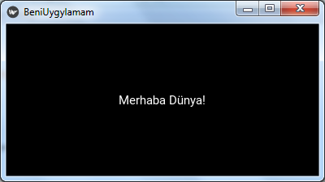

###############
Merhaba Dünya
###############

Hemen her programlma dilinde ilk yazılan program "Merhaba Dünya" cümlesinin yazılmasıdır. Bu belgede de bu geleneği bozmayacağız
ve Kivy'i öğrenmeye bununla başlayacağız. IDLE'e kullanarak aşağıdaki program kodunu yazın ve ``merhaba_dunya.py`` olarak kaydedin.

.. literalinclude:: ./programlar/merhaba_dunya.py
    :linenos:
    :caption: :download:`merhaba_dunya.py<./programlar/merhaba_dunya.py>`
    :name: merhaba_dunya
    :language: python

Programı çalıştırdığınızda aşağıdaki gibi bir pencere açılacaktır.

   ``merhaba_dunya.py`` programının ekran görüntüsü

hhh
