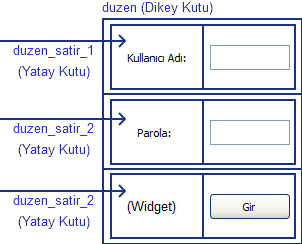

.. _merhabaDunyaBolumu:

###############
Merhaba Dünya
###############

Hemen her programlma dilinde ilk yazılan program "Merhaba Dünya" cümlesinin yazılmasıdır. Bu belgede de bu geleneği bozmayacağız
ve Kivy'i öğrenmeye bununla başlayacağız. IDLE'e kullanarak aşağıdaki program kodunu yazın ve :ref:`merhabaDunya` olarak kaydedin.

.. literalinclude:: ./programlar/merhabaDunya.py
    :linenos:
    :tab-width: 4
    :caption: merhabaDunya.py
    :name: merhabaDunya
    :language: python

Programı çalıştırdığınızda :numref:`Şekil %s <merhabaDunyaImg>`'deki gibi bir pencere açılacaktır.

.. _merhabaDunyaImg:

.. figure:: ./resimler/ilkUygulama.png

   Merhaba Dünya

Biraz bu program üzerinde konuşalım. Buraya kadar geldiğinize göre ``import`` satırlarını
biliyor olmalısınız, bu nedenle burayı geçiyorum. Bütün Kivy programları bir ana
sınıf tarafından yönetilir. Bu anasınıf Kivy'deki ``App`` sınıfını içerir. Bu programdaki ana
sınıfımız ``ilkUygulama()``  dır. Ana sınıftaki :index:`build()` işlevi mutlaka bir pencer düzeni döndürür
ve bu düzen program açıldığında kullanıcnın ilk gördüğü penceredir. Buradaki program
çok basit olduğundan bir pencere düzeni döndürmek yerine sadece bir :index:`etiket` (:index:`Label`) döndürmüştür,
ve bu etikat ana pencere olarak karşımıza çıkmaktadır. Uygulamanın çalıştırılması,
ana sınıfın ``run()`` özelliği ile yapılır. Buradaki ``ilkUygulama().run()`` satırı
uygulamamızın çalışmasını sağlar.

Eğer pencere ismi verilmemişse, pencerinin başlığında ana sınıfın ismi görünecektir. Pencere başlığını
değiştirmek için, :index:`title` özelliğini kullanabiliriz. Sınıf tanımlanır tanımlanmaz hemen altında (``def build(self):``
ile aynı hizada) aşağıdaki satırı ekleyerek yapabilirsiniz:

::
	
	title = 'Benim Kivy Programım'
	
Bir diğer yöntem ise, ``build()`` işlevi altında ``return`` etmeden hemen önce şu satırı eklemektir:

::
	
	self.title = 'Benim Kivy Programım'
	
Benzer şekilde pencere için kullanılacak olan simgeyi de :index:`icon` özelliğini kullanarak yapabilirsiniz. Son durumda ``build()``
işlevini şu şekilde yazabilirsiniz:

::

	def build(self):
		self.title = 'Benim Kivy Programım'
		self.icon = 'simge.png'
		return Label(text='Merhaba Dünya!')
        
        
``simge.png`` dosyası, ya ``merhaba_dunya.py`` dosyasının kaydedildiği yerde olmalı ya da tam patika yazılmalıdır. Örneğin ``resimler``
klasörüne koymuş iseniz:

::

	self.icon = 'resimler/simge.png'
	
şeklinde yazılmalıdır.

.. _merhabaDunyaPencereDuzenleri:

Pencere Düzenleri
=================
Bir pencereye birden fazla :index:`Grafik Parçacığı` (widget) koyacaksanız, bir pencere düzeni oluşturmalısınız. Kivy programlarındaki pencere düzenleri iki şekilde oluşturulabilir: 

* Pencere düzenleri kodlarıya
* Kivy ``kv`` dili ile

:index:`Izgara Pencere Düzeni`
-----------------------------

Bu belge kapsamında ``kv`` dili kullanılacaktır. Ancak bir fikir vermesi açısından kodlayarak nasıl yapıldığını basit bir örnek
ile açıklamaya çalışalım. Şöyle bir pencereye ihtiyacımız olsun:

.. figure:: ./resimler/kullaniciGirisMockups.png

Bunun için altı adet grafik parçacığına (aslında pencere düzeni ile yedi) ihtiyacımız var. İki tanesi etiket (``Label``) iki tanesi :index:`Metin Kutusu` (:index:`TextInput`) ve bir
tanesi :index:`Düğme` (index:`Button`). Bir tanede boş grafik parçacığı (:index:`Widget`). Bu programı :numref:`girisFormu` gibi yazabiliriz.

.. literalinclude:: ./programlar/girisFormu.py
    :linenos:
    :tab-width: 4
    :caption: girisFormu.py
    :name: girisFormu
    :language: python
    

Programımız şimdilik bir işe yaramamaktadır. Tek yaptığı bir giriş penceresi
oluşturmak ve bunu kullanıcıya göstermektir. Düğmenin nasıl kullanılacağı, metin kutularındaki değerlerin nasıl alınacağı ileriki 
konularda anlatılacaktır. Burada  :index:`GridLayout` ile ızgara pencere düzeni oluşturulmuştur. Bu sınıfa verilen ``cols=2`` parametresi
ızgaranın iki sütundan oluşacağını söylemktedir. Kaç satırdan oluşuacağını belirtmiyoruz. Bir garfik parçacığına (burada ızgara pencere
düzeni) bir başka grafik parçacığını ``add_widget()`` ile ekliyoruz. Buradaki ızgaramız iki sütunlu olduğundan
ızgara düzenine eklenen her iki parçacık bir satırda bulunur ve daha sonra yeni satıra geçilir. 
Şimdi size bir soru: Sizce 24. satırı ``duzen.add_widget(Widget())`` neden yazmışızdır? 

Programımız çalıştığında :numref:`Şekil %s <kullaniciGirisImg>` 'deki gibi bir pencere açılacaktır. 

.. _kullaniciGirisImg:

.. figure:: ./resimler/girisFormu.png

   Giriş Formu

:index:`Kutu Pencere Düzeni`
-----------------------------
Benzer bir pencereyi kutu pencere düzeni ile oluşturalım. Kutu pencere düzeni :index:`BoxLayout` parçacığı ile oluşturulur.
:numref:`kutuPencereDuzeni1` programını inceleyin.

.. literalinclude:: ./programlar/girisFormuKutu1.py
    :linenos:
    :tab-width: 4
    :caption: girisFormu.py
    :name: kutuPencereDuzeni1
    :language: python

Programımız çalıştığında :numref:`Şekil %s <girisFormuKutu1Img>` 'deki gibi bir pencere açılacaktır. 

.. _girisFormuKutu1Img:

.. figure:: ./resimler/girisFormuKutu1.png

   Giriş Formu (Dikey Yönelimli)

Bu pencere bizim istediğimiz değil. Kutu pencere düzeninin ön tanımlı yönelimi yataydır. Yani eklenen parçacıklar yan yana görünür.
Dikey olması için kutu pencere düzenini oluşturan ``BoxLayout()`` grafik parçacığına ``orientation='vertical'`` paramteresini
verdik. Dikey yönelimli bir kutu pencere düzeninde tüm parçacıklar alt alta eklenir. Oysaki biz, ilk etiket ile ilk metin kutusunu yan yana,
sonraki ikilileri de yine yan yana istiyoruz. O halde, ana düzeni oluşturan kutu pencere düzeninin ilk satırına bir başka
kutu pencere düzeni yerleştirmeliyiz. İkinci kutu pencere düzeninine eklediğimiz parçacıklar zaten yan yana görünecektir.
Anlatmak istediğimi aşağıdaki şekilde çizdim:

Yukarıdaki çizimde gördüğünüz pencere düzenini oluşturacak program :numref:`kutuPencereDuzeni2`'dadır.

.. literalinclude:: ./programlar/girisFormuKutu2.py
    :linenos:
    :tab-width: 4
    :caption: girisFormu.py
    :name: kutuPencereDuzeni2
    :language: python

:numref:`kutuPencereDuzeni2`'deki programı çalıştırdığımızda bize :numref:`Şekil %s <kullaniciGirisImg>` 'deki pencerenin aynısını verecektir.

Diğer Pencere Düzenleri
-----------------------
Kivy yukarıda anlattığımız, pencere düzenlerinden daha fazlasını sunar. Tüm pencere düzenlerini şöyle özatleyebiliriz.

AnchorLayout:
	Grafik parçacıkları 'top' (üst), ‘bottom’ (alt), ‘left’ (sol), ‘right’ (sağ) veya ‘center’ (orta) konuma yerleştirielbilirler.

BoxLayout:
	Grafik parçacıkları 'vertical' (dikey) veya 'horizontal' (yatay) yönelimli olarak yerleştirilebilirler.

FloatLayout:
	Grafik parçacıkları istenilen herhangi bir konuma yerleştirilebilirler.

RelativeLayout:
	Çocuk grafik parçacıkları düzene göreceli olarak yerleştirilebilirler.

GridLayout:
	Grafik parçacıkları ızgara şeklinde  yerleştirilebilirler.

PageLayout:
	Çoklu sayfa düzeni oluşturmak için kullanılabilir.

ScatterLayout:
	Grafik parçacıkları RelativeLayout'da olduğu gibi yerleştirilebilir ancak bunlar dönrürülebilir ve ölçeklenebilir.

StackLayout:
	Grafik parçacıkları üst-alt ve sağ-sol'a kaydırılacak şekilde yerleştirilebilir.

İhtiyaç oldukça bu pencere düzenlerini kullanacağız ve oralarda daha ayrıntılı açıklayacağız.

Pencere düzenlerinin kod yazarak oluşturulması, mekanik bir işlemi tekrarlamaktır. Kivy'de bizi bu dertten kurtarack bir diğer yöntem vardır:
``kv lang`` (veya ``kv`` dili). Bunu :ref:`kivyDili` bölümünde anlatacağız.
