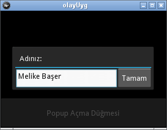
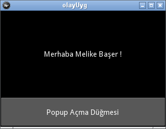

.. _olaylarBolumu:

################
Olaylar ve Popup
################

Türkçe'de "Ortaya çıkan, oluşan durum" olarak tanımladığımız :index:`olay` (:index:`event`), Kivy için de geçerlidir.
Örneğin  "düğmeye bastırmak", "bastırılmayı bırakmak", "seçim yapmak", "bir tuşa basmak" gibi birçok durum birer 
Kivy olayıdır. Bu olaylar gerçekleştiğinde, programımızın bir tepki vermesi gerekir. Bir olay gerçekleştiğinde verilecek
tepki bir işlev (fonksiyon) tarafından gerçekleştirilebilir. Olay gerçekleştiğinde ilgili fonksiyonun çağrılabilmesi
için, fonksiyonu olaya bağlamak gerekmektedir.

Önce bir düğmeye bastırıldığında üzeirndeki metnin değişmesini sağlayacak bir
program yazmaya çalışalım. Bu programı öncelikle Python kodu yazarak öğreneceğiz, daha sonra ``kvlang`` ile nasıl
gerçekleştirilebileceğine bakacağız. Programımız :numref:`olaylar_main1`'de görülmektedir.

.. literalinclude:: ./programlar/olaylar/1/main.py
    :linenos:
    :tab-width: 4
    :caption: main.py
    :name: olaylar_main1
    :language: python

:numref:`olaylar_main1`'deki programı çalıştırdığımızda tüm ekranı kaplayan bir düğme görünecektir. Düğmenin üzerinde
"Değiştir" metni görünmektedir. Bu düğmeyi ``self``'in bir özelliği yapmamaızın nedeni, sınıf içerisindeki tüm işlevlerden
erişebilmektir. Bu düğmeye bastırıldığında çağrılacak olan işlevi, düğmeinin ``bind()`` özelliği
ile bağlıyoruz. Bir olayı bir nesneye bağlamak için ``bind()`` özelliğini kullanırız. Bu işleve, hangi olayı
bağlamak istiyorsak, onu parametre ve bu parametreye de çağrılacak olan işlevi yazıyoruz. 15. satırda 
``bind()`` işlevine :index:`on_press` parametrisini (bu düğmeye bastırılma olayını ifade eder) ve değer olarak ta
``self.metni_degistir`` işlevini atadık. Böylelikle düğmeye bastırıldığında ``self.metni_degistir`` işlevi çağrılacaktır.
Çağrılan işleve nesnenin kendisi (burada ``self.dugme``'dir) argüman olarak gönderilir. Aslında ``dugme``'yi ``self``'in
özelliği yapmadan, gelen nesne üzerinden de metni değiştirebilirdik:

::

  nesne.text='Tıkladın ve değiştim.'

aynı görevi görürdü. Şimdi aynı programı ``kv lang`` ile yazalım. Programımızı :numref:`olaylar_main2`'da görüyorsunuz.

.. literalinclude:: ./programlar/olaylar/2/main.py
    :linenos:
    :tab-width: 4
    :caption: main.py
    :name: olaylar_main2
    :language: python

İlgili ``kv`` dosyasını :numref:`olaylar_kv2`'da görüyorsunuz.

.. literalinclude:: ./programlar/olaylar/2/olayuyg.kv
    :linenos:
    :tab-width: 4
    :caption: olayuyg.kv
    :name: olaylar_kv2

Şimdi biraz program ve ``kv`` dosyası üzerinde konuşalım. ``kv`` dilinde garfik parçacıklarına isimleri ``id`` özelliği
ile veriyoruz. 3. satırdaki ``id: dugme`` yapmamızın nedeni bu garfik parçacığına (nesneye) program içerisinden ulaşmak için kullanacağımızdır.
Bu düğmeye bastırıldığında çağrılacak olan işlevi ``app``'ın bir özelliği ile veriyoruz. Çağrılan uygulamanın tüm nesneleri,
``kv`` dili içerisinden ``app``'ın özelliği ile erişilir. :numref:`olaylar_main2` programına bakacak olursak, ``kv`` dili 
içerisinde tanımlanmış grafik parçacıklarına erişmek için ``self.root.ids``'nin bir özelliği ile eriştiğimizi anlarsınız. ``kv``'deki
bir nesneye erişmek için o nesnenin ``id`` ile verilmiş ismini kullanıyoruz.

Kullanıcının metin gireceği bir metin kutusu, altında bir etiket ve onun altında da bir düğme bulunan bir program yazalım. Bu programı
yazmadaki amacımız, metin kutusuna girilen değeri etikette görüntülemktir. Programımızı :numref:`olaylar_main3`'da görüyorsunuz.

.. literalinclude:: ./programlar/olaylar/3/main.py
    :linenos:
    :tab-width: 4
    :caption: main.py
    :name: olaylar_main3
    :language: python

Bu programla kullanacağımız ``kv`` dosyasını da :numref:`olaylar_kv3`'da görüyorsunuz.

.. literalinclude:: ./programlar/olaylar/3/olayuyg.kv
    :linenos:
    :tab-width: 4
    :caption: olayuyg.kv
    :name: olaylar_kv3

``kv`` dosyasında etiket için neden ``markup: True`` dediğimizi sonra açaıklayacağız. Programımızı çalıştıralım ve 
üstteki metin kutusuna adımızı yazalım. "Değiştir" düğmesine tıkladığımızda, metin kutusundaki isim etiket üzerine yazılacaktır.
Programın çalışmış halini :numref:`Şekil %s <olaylar1Img>` 'de görüyorsunuz.

.. _olaylar1Img:

.. figure:: ./resimler/olaylar1Img.png

   Girilen metnin etikete yazılması
   
:index:`İşaret Dili` (:index:`markup`)
=======================================

Etiket ve düğmelerde renklerin kullanımı çok kolay.  :numref:`olaylar_kv3`'deki ``kv`` dosyasının 8. satırında ``markup: True``
bulunmaktadır. Bunun anlamı bu etiket metni için işaret dilinin (markup) kullanılacağıdır. Eğer program içerisinde
bir etiket tanımlamış olsaydık, işaret dilini etkinleştirmek için

::

  etiket = Label(markup=True)

diyebilirdik. Ya da daha önceden tanımlanmış bir ``etiket`` nesnesi için:

::

  etiket.markup=True
  
 
şeklinde aktifleştirebilirdik. Keşke Kivy tıpkı Qt gibi standart html'yi desteklemiş olsa idi, ancak ne yazıkki standart
html yerine kendi içerisinde birtakım işaretler vardır. Önce  :numref:`olaylar_main2`'deki programda kullanıcının adını
etikete yazarken kırmızı reknte yazmayı deneyelim. Bunun için 7. satırı aşağıdaki gibi değiştirin:

::
 
  self.root.ids.etiket.text='Merhaba [color=#FF0000] %s [/color] !' % girilen_metin
  
Artık isim kırmızı renkli olacaktır. Burada anlaşılacağı gibi Kivy işaretleri [işaret] ile başlamakta ve
[/işaret] ile bitirlmektedir. Sonucu :numref:`Şekil %s <olaylar2Img>` 'de görüyorsunuz.

.. _olaylar2Img:

.. figure:: ./resimler/olaylar2Img.png

   Etiketlerde renk kullanımı
   
Kullanabileceğimiz diğer işaretler şöyle:

[b][/b]
	Kalın metin
[i][/i]
	İtalik metin
[u][/u]
	Altı çizili metin
[s][/s]
    Üstü çizili metin
[font=<str>][/font]
    Yazıtıpi belirtimi. Örneğin ``[font=DejaVuSerif.ttf]Merhaba Kivy![/font]``
[size=<integer>][/size]
    Yazıtıpi boyutunu belirtir
[color=#<color>][/color]
    Yazı rengini değiştirir
[ref=<str>][/ref]
    Metne bir link (bağ) konulur. Bu bağa tıklandığında "ref" de verilen değer, işleve gönderilir.
[sub][/sub]
    Alt simge olarak gösterilir
[sup][/sup]
    Üst simge olarak gösterilir
    
Basit bir diğer örnek olarak ``ref``'i kullanalım.  :numref:`olaylar_main4`'deki programda etiket üzerindeki metne
tıklandığında ekrana (komut satırına) ``Selam Melike !`` yazacaktır.

.. literalinclude:: ./programlar/olaylar/4/main.py
    :linenos:
    :tab-width: 4
    :caption: main.py
    :name: olaylar_main4
    :language: python

Eğer ``yazdir()`` işlevini şu şekilde değiştirecek olursanız:

::
  
  nesne.text = deger
  
Bu durumda, etiketteki "Merhaba  Fatih !" metine tıkladığınızda, bu metin yerine "Merhaba  Melike !" görünecektir.

:index:`Popup Pencere`: (:index:`popup`)
========================================

Bir programcının başı sıkıştığında hemen bir Popup pencereye başvurur. Kivy'de bu işlem oldukça basit. Önce program kodu
ile nasıl yapılacağına bakalım. :numref:`olaylar_main5`'deki programı inceleyin.

.. literalinclude:: ./programlar/olaylar/5/main.py
    :linenos:
    :tab-width: 4
    :caption: main.py
    :name: olaylar_main5
    :language: python

Bu programın ana düzeni bir tane düğmeden oluşmaktadır. Bu düğmeye tıklandığında ``self.popAc()`` işlevi çağrılmaktadır.
Popup penceremiz bu işlevde açılmaktadır. Öncelikle açılacak pencerenin içeriğini hazırlamak gerek. Bu içerikte sadece
bir etiket bulunmaktadır. Siz istediğiniz bir pencere düzeni kullanarak içeriği istediğiniz gibi oluşturabilirsiniz. Bu içerik ``popup`` nesnesinin ``content`` parametresine verilmiştir. Genelde 17. satırda bulunan ``bind(on_touch_down=popup.dismiss)`` bağlantısını genellikle yapmayız. Biz burada tam bir örnek olsun diye verdik. 
:index:`on_touch_down` olayı bir grafik parçacığına dokunulduğunu ifade eden olaydır. Burada Popup penceresindeki 
içeriğe dokunulduğunda pencerenin kapanmasını sağlayan :index:`dismiss` işlevi aktifleştirilmiştir. Bu programda (200,200)
boyutlarında bir Popup penceresi açılır. Normalde Popup penceresinin dışındaki bir alana dokunulduğunda Popup kapanır.
Eğer otomatik olarak kapanmasını istemiyorsanız :index:`auto_dismiss` parametresinin değerini ``False`` yapmalısınız. Yani
``auto_dismiss=False`` kullanmalısınız.

``kv`` dili ile bir Popup oluştruracağız. Biraz daha karmaşık bir program oluşturalım. Ana penceremizde bir etiket olsun,
etiketin altında bir düğme ve bu düğmeye bastırılınca bir Popup açılsın. Bu Popup biraz daha farklı olsun, sanki *ModalView* gibi
davransın. Açılan Popup penceresine bir metin kutusu ve hemen yanına bir düğme ekleyelim. Popup dışarı bir yere tıklanınca
kapanmasın. Üzerindeki düğmeye bastırılınca önce yapacağı işi yapsın sonra da kapansın. Önce ``kv`` dosyasından başlayalım.
Daha önce bir ``kv`` dosyasında sadece ana pencereyi tanımlamıştık, oysaki bir programda birden çok pencere olabilir ve bunların
hepsi bir ``kv`` dosyasında tanımlanabilir. Eğer birden fazla pencere tanımlanacaksa, programda (bize ``main.py``) her pencereya ait
bir sınıf tanımlanmadır. Bu sınıfa ait pencere düzeni ``kv`` dosyasında *<sınıfAdı>:* ile belirtilir. 'deki ``kv`` 
:numref:`olaylar_kv6`'dosyasını inceleyin.

.. literalinclude:: ./programlar/olaylar/6/olayuyg.kv
    :linenos:
    :tab-width: 4
    :caption: olayuyg.kv
    :name: olaylar_kv6

Burada ``<olayUyg>`` daha önceden da kullandığımız, ana sınıfımızın (``olayUyg()``) penceresini oluşturmak için kullanılacaktır.
``<PopUpPencere>`` bloğundaki tanımlar ise, programımızda ``PopUpPencere()`` isimli bir sınıf tanımlanacak ve o sınıfın pencere
düzenini oluşturacaktır. Dikkat etmiş iseniz, ana sınıfımıza ait grafi parçacıkların kodları en soldan başlamaktadır, 
diğer bir deyişle (``<olayUyg>:``) ile aynı hizada başlıyor. Hemen altında ``BoxLayout:`` düzeni tanımlanıyor. Diğer sınıflara ait
pencere düzenlerini tanımlarken ise *<sınıfAdı>:* en soldan, bunun altındaki kodlar bir içerden tanımlanıyor. Aslında ana pencereye ait
kodlar tanımlanırken *<anaSinifAdı>:* yazmaya da gerek yoktur. Ancak kod okunurluğu açısından bu satırı ekliyoruz. 
Buna göre :numref:`olaylar_kv6`'deki ilk satır yazılmasa da düzgün çalışır.

Dosya yapısından sonra birazda kodlardan konuşalım. Ana sınıfın penceresin oluşturan ``<olayUyg>`` bloğunda bir kutu düzeni oluşturuluyor.
Bu bir etiket (``size_hint_y: 3`` ile pencerenin %75'ini kaplar), altında bir düğme oluşturuluyor. Bu düğme tüm yüksekliğin %25'ini
kaplamaktadır. Düğmeye bastırıldığında uygulamadaki (diğer bir deyişle programımızda tanımlı ana sınıfımız olan ``olayUyg()``)
``popAc()`` işlevi çağrılıyor. ``kv`` dosyalarında ana sınıftaki tüm nesnelere ``ap``'ın bir özelliği olarak erişilebileceğini tekrar
hatırlatalım. İkinci penceremiz (``<PopUpPencere>``) açılacak olan Popup'ın düzenini oluşturmak için kullanılacaktır. Buradan
programda bu düzeni kullanacak olan sınıfın ``PopUpPencere()`` olacağını anlıyoruz. İlk defa bir pencerenin piksel olarak
büyüklüğünü nasıl belirleyebileceğimizi görüyoruz. Bunu :index:`size` ile yapıyoruz. Eğer bir grafik parçacığında ``size`` parametresini
kullanırsanız, ``size_hint``'i mutlaka ``None`` yapmalısınız. ``size`` parametresine bir tüp atanır ve bu tüp grafik parçacığının 
piksel olarak (eni, boyu) şeklindedir. Burada eni 300, boyu 100 piksel olan bir pencere açılacaktır. Daha önce oralnları 
``size_hint_x`` ve ``size_hint_y`` olarak vermiştik. İkisini bir arada vermek için :index:`size_hint` kullanabilirsiniz. Yine
bu parametre bir tüp alır ve (en_oranı, boy_oranı) şeklindedir. Popup pencerenin dışında bir yere tıklandığında kapanmasını
önlemek için ``auto_dismiss: False`` satırını kullandık. Gelelim düğmeye: düğmeye bastırıldığında ``on_press`` uygulamanın
bir özelliğine erişebilmektedir. Bu özelliği ``ap``'dan alabiliyoruz. Fakat düğmeye bastırıldığında, düğmeye ait sınıftaki 
bir işlevi çağırmak istiyoruz. Bu durumda, düğmenin sınıfını (``PopUpPencere()``) na sınıfın bir özelliğ yaparsak, o zaman düğme sınıfındaki
nesnelere ``ap``'ı kullanarak erişebiliriz. İşte bu anlattıklarımız programımızın (numref:`olaylar_main6`) 14. satırında:

::

  self.popup=PopUpPencere()
  
şeklinde yazarak ``PopUpPencere()`` sınıfını ana sınıfın bir özelliği haline getiriyoruz. Bir sınıfta bir nesneyi ``self``'in
özelliği yaparsanız, bu özellik o sınıfınızın bir özelliği olur ve o sınıf içerisinden her yerden erişilebilir. Böylelikle `
``PopUpPencere()`` sınıfına ait özelliklere, ana sınıf içerisinden ``self.popup``'ın bir özelliği olarak erişilebilir. ``kv`` dosyasında
ana sınıf ``app`` olarak erişiliyordu, bu durumda ``app.popup`` nesnesi ``PopUpPencere()`` sınıfını temsil edecektir.
Eğer ``PopUpPencere()`` sınıfının içerisinden ana sınıfımıza ait özelliklere erişmek istyorsak, ``PopUpPencere()``'da çağırdığımız
işlevlere ana sınıfın kendisini argüman olarak göndermemiz gerekir. Eğer program kodundan çağırıyorsak ``self``'i, ``kv`` dosyasında
çağırıyorsak ``ap``'ı argüman olarak göndermeliyiz. Elbette işlevde bu argümanı alacak bir parametre bulunmalıdır. 
:numref:`olaylar_kv6`'dosyasında Popup penceredeki düğmeye bastırıldığında ``app.popup.olayDugme(app)`` işlevini çağırdık. 
``PopUpPencere()`` sınıfında tanımlanacak ``olayDugme()`` işlevi ``app``'ı alacaktır. 
Bunu :numref:`olaylar_main6`'deki 6. satırda görüyorsunuz.

:numref:`olaylar_kv6` ``kv`` dosyasını kullanacak olan programımız :numref:`olaylar_main6`'da yazılmştır.

.. literalinclude:: ./programlar/olaylar/6/main.py
    :linenos:
    :tab-width: 4
    :caption: main.py
    :name: olaylar_main6
    :language: python

Bu programda ``olayDugme()`` işevi ana penceredeki etikete erişiyor ve Popup'da girilen ismi ana pencerenin etiketine yazıyor. 
``kv`` dosyasındaki ``on_press: app.popup.olayDugme(app)`` satırı, ana sınıfı (``app``) bu işeleve gönderiyor, bu işlevin ``uyg``
parametresine atanıyor. Böylelikle ``uyg.root.ids`` kullanılarak ana penceredeki tanımlanmış grafik parçacıklarına erişebiliyoruz.

Programımızı çalıştırıp alttaki düğmeye bastırdığımızda elde edeceğimiz görüntü :numref:`Şekil %s <olaylar3Img>`'deki gibi olacaktır.

.. _olaylar3Img:

   Popup'ın açılması
   
Adımızı yazıp "Tamam" düğmesine bastırdığımızda Popup kapanacak ve :numref:`Şekil %s <olaylar4Img>`'deki gibi olacaktır.

.. _olaylar4Img:

   Popup işevinden Ana Penceredeki metnin değiştirilmesi.
   
Artık basit bir uygulama yazabiliriz. Şu can sıkıcı ve hiçbir işe yaramayan :ref:`metinDuzenleyiciBolumu` yazacak kadar bilgi sahibi olduk.
