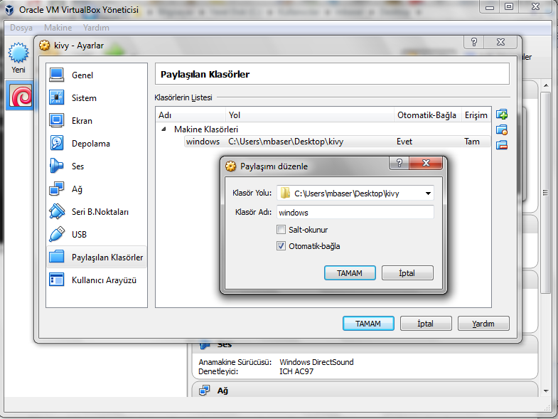
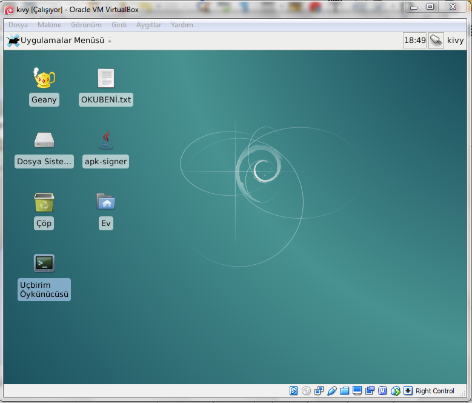

.. _paketleme:

##########
Paketleme
##########

Bu bölümde hazırlanan Kivy programının Android paketi haline getirilmesi anlatılacaktır.

:index:`Buildozer` Kurulumu
****************************

Kivy programlarını paketlemenin en kolay yolu Buildozer kullanmaktır. Ne yazıkki Buildozer şimdilik sadece Linux'ta çalışmaktadır.
Windows kullanıcıları için VirtualBox üzerinde Sanal Linux Makina disk görüntüsü hazırlanmıştır. Windows kullanıcıları belkide çoğu
Linux kullanıcıları :ref:`SanalLinux` bölümünde anlatılanları yapabilirler.

Burada sadece Debian Jessie'de (8.3) nasıl kurulacağını anlatacağız. 
Sisteminizde ``git`` kurulu değilse: 

.. code-block:: console

  # apt-get install git

Yazılım havuzundan indirelim:

.. code-block:: console

  # git clone https://github.com/kivy/buildozer.git
  
Kurulumu gerçekleştirelim:

.. code-block:: console

  # cd buildozer
  # python setup.py install

Eğer sisteminizde eksik paket var ise, size hangilerinin eksik olduğu bildirilecektir. Bu kurulum yeni kurulmuş  Debian Jessie'de (8.3) de
denenmiştir. İleriki zamanlarda buildozer debian paketi çıkarsa daha kolay kurulum gerçekleştirilebilir.

Muhtemelen sisteminizde zlib1g-dev ve Cython kurulu olmayacak:

.. code-block:: console

  # apt-get install zlib1g-dev
  # apt-get install cython
  
Henüz Java derleyicisini kurmamış iseniz:

.. code-block:: console

  # apt-get install gcj-jdk 

Buildozer'in paketleyebilmesi için 32 bit kütüphanelere ihtiyacı olacak. Şu şekilde kurabilirsiniz:

.. code-block:: console

  # dpkg --add-architecture i386
  # apt-get update
  # apt-get install build-essential ccache lib32z1 libncurses5:i386 libstdc++6:i386 openjdk-7-jdk unzip zlib1g:i386

Tüm bu anlattıklarımı, VirtualBox üzerinde bir sanal makinada yaptım ve disk görüntüsünü

kullanımınız için aşağıdaki adrese koydum:

https://docs.google.com/uc?export=download&confirm=Ser1&id=0B3-o4L3R6zHvOE9OdDBCUmhLZ0E

Sizin tek yapmanız gereken yapmanız gereken :ref:`SanalLinux`'de anlatılan VirtualBox'u kurmak.

.. _paketlemeKismi:

Paket Derleme
**************

Paket haline getirmek için önce başlatalım:

.. code-block:: console

  $ buildozer init

Daha sonra buildozer.spec dosyasını düzenleyelim. Ben sadece aşağıdaki değişiklikleri yaptım:

::

  # (str) Title of your application
  title = Kivy Metin Duzenleyici

  # (str) Package name
  package.name = kiviymetinduzenleyici

  
  
 
Şimdi de sıra paketlemeye geldi:

.. code-block:: console

  $ buildozer android release

Şu şekilde başlaması gerekiyor:

::

	# Check configuration tokens
	# Ensure build layout
	# Check configuration tokens
	# Preparing build
	# Check requirements for android
	# Install platform
	....

İlk kez paketleme yapıyorsanız, ANT, SDK, NDK indirilecektir. Lütefn sabırlı olun. Daha sonra paketleme işlemi yapılacaktır. Benim
sanal makinamda bu işlem 10 dakikadan fazla sürmektedir. Şu şekilde sonlanması gerekir:

::

	# Android packages installation done.
	# Check application requirements
	# Check garden requirements
	# Compile platform
	# Distribution compiled.
	# Build the application #1
	# Package the application
	# Android packaging done!
	# APK KivyMetinDuzenleyici-0.1-release-unsigned.apk available in the bin directory

Derlenen dosya, derlemeyi başlattığınız klasörün içerisinde oluşturulan ``bin`` klasörüne
kaydedilmiştir. Bu dosyayı Android cihaza kurmadan önce imzalamanız gerekmektedir.

İmzalama
********

Paketinizi kurmadan önce imzalamanız gerekir. Bunun en kolay yolu `apk-signer <http://shatter-box.com/download/android/apk-signer-1.8.5.zip>`_
kullanmaktdır. Programı indirdikten sonra zip paketini açın çalıştırın. Tarafımdan hazırlanan Sanal Linux Makina  kullanıyorsanız, masaüstünde `apk-signer`
simgesi üzerine tıklayın. 

Anahtar Oluşturma
-----------------

Önce anahtar oluşturacağız (:ref:`SanalLinux` kullananlar için `kivy` ev klasöründe bir tane anahtar mevcut). Programınız çalıştığında *Key Generator*
sekmesinde olacaktır. Bu sekmede iken ilk yapacağınız anhtarınızı kaydedeceğiniz dosyayı belirlemek. Bu amaçla *[ Save as... ]* düğmesine tıklayın.
Anahtarınızı kaydedeceğiniz klasörü seçin (bizdeki örnekte `/home/kivy`) ve dosya adını yazın (biz `benim` yazdık). Yaptıklarımız
:numref:`anahtarDosyasiImg` görünmektedir.

.. _anahtarDosyasiImg:

.. figure:: ./resimler/paketleme/anahtarDosyasi.png

   Anahtar Dosyası

Daha sonra gerekli bilgileri doldurun. *Password* ve *Confirm* alanlarına aynı parolayı girin (en az 8 karakter). Bizim örneğimizde
`kivy123` girdik. Bir *Alias* belirleyin, biz `Kivy` yaptık. Alias'ınız için yine parola (*Alias password* ve *Confirm* alanlarına)
girin. Biz yine `kivy123` girdik. Bu parolaları unutmayın, çünkü bundan sonra imzalayacağınız her pakette kullanacaksınız. Diğer
alanları istediğiniz gibi doldurun. :numref:`anahtarDosyasiImg`'de oluşturduğumuz anahtar için bilgilerin girilmiş hali görünmektedir.

.. _anhatarOlusturmaImg:

.. figure:: ./resimler/paketleme/anahtarOlusturma.png

   Anahtar Oluşturma

*Generete Keyfile* düğmesine tıklayarak anahtarınızı oluşturun.

İmzalama
---------
Anahtarınızı (aslına imzanız) oluşturduktan hemen sonra paketinizi imzalayabilirsiniz. Bunun için *Signer* sekmesine geçin. 
Önce *[ Load Keyfile... ]* düğmesine tıklayarak, oluşturduğunuz anahtarı seçin. Eğer oluştruruken yukarıdaki gibi `benim` 
yazmışsanız, ev dizininizde `benim.keystroke` dosyasını seçin. Bu imzanın parolasını *Password* alanına yazın. Bir Alias seçin 
(yukarıda `Kivy` yazdık) ve bunun parolasını *Alias password* alanına girin. *[ Load target file... ]* düğmesine tıklayın. Açılan
pencerede imzalamak istediğiniz paketi seçin, biz Kivy Metin Düzenleyici'yi derlemiştik onu seçiyoruz (`MetinDuzenleyici/bin/
KivyMetinDuzenleyici-0.1-release-unsigned.apk`). Yaptıklarımız :numref:`imzalamaImg`'de görünmektedir.

.. _imzalamaImg:

.. figure:: ./resimler/paketleme/imzalama.png

   APK Paketini imzalama

Son olarak *Sign* düğmesine tıklayın. Şimdi `MetinDuzenleyici/bin/KivyMetinDuzenleyici-0.1-release-SIGNED_UNALIGNED.apk`
dosyasını bir Android cihaza kurabilirsiniz.

.. _SanalLinux:

Sanal Linux Makina
*******************

Windows kullanıcıları için Linux'u ve diğer paketleri kurmadan (epeyce zahmetli bir iş), programlarını apk haline getirebilecekleri
bir sanal makina disk görüntüsü hazırlanmış 
`https://docs.google.com/uc?export=download&confirm=Ser1&id=0B3-o4L3R6zHvOE9OdDBCUmhLZ0E <https://docs.google.com/uc?export=download&confirm=Ser1&id=0B3-o4L3R6zHvOE9OdDBCUmhLZ0E>`_
adresine konulmuştur. Bu dosyayı indirin ve bir arşiv programı ile (örneğin winrar) masaüstüne açın.

Sanal makine disk görüntüsü Oracle VirtualBox 5.0.16 r105871
sürümü ile hazırlanmıştır. Kullanıcılar mutlaka bu sürümü indirmelidir. Diğer sürümlerde windows-linux bağlantısı
sağlanamayabilir ve ana makinanızın dosyalarına erişiminiz olamayabilir.

VirtualBox kurulumu
---------------------

https://www.virtualbox.org/wiki/Download_Old_Builds_5_0 adresinden 5.016 sürümünü indirin ve 
inen dosya üzerine çift tıklayın. Birkaç “Next” düğmesine tıkladıktan sonra “Install” düğmesine
tıklayın. Size uyarı “Bu aygıt yazılımını ....” uyarısını verdiğinde “Yükle” düğmesine tıklayın. 

Sanal Makina Oluşturma
-----------------------

Vitrualbox açıldığında yeni bir sanal Makine oluşturmak için sol üst köşedeki “Yeni” 
düğmesine tıklayın. Açılan pencerede “Adı” alanına istediğiniz bir isim yazın,
ben kivy yazmayı tercih ettim. Türü “Linux”, Sürüm “Debian (32-bit)” seçin (:numref:`vb_1Img`'de)

.. _vb_1Img:

.. figure:: ./resimler/paketleme/vb_1.png
	
	Makina mimarisi seçimi

“İleri” düğmesine tıkladığınzda sanal makine için ayıracağınız belleği seçmeniz gerekmektedir.
Her ne kadar 768MB önerilse de, 1024MB’den daha fazla bir bellek ayırmaya çalışın. 
Ben genelde 1536MB (1.5GB) ayrımayı tercih ediyorum (:numref:`vb_2Img`'de):

.. _vb_2Img:

.. figure:: ./resimler/paketleme/vb_2.png
	
	Sanal makinenin belleğini belirleme

“İleri” düğmesine tıkladığınızda sanal makinanın kullanacağı disk görüntüsünü belirleyeceğiniz
pencere gelecektir. Burada “Var olan sanal bir sdabit disk dosyası kullan” seçeneğini seçip,
|mysdc| simgesine tıklayın ve daha önce indirip açtığınız ``deb-i386.vdi``
dosyasını seçin (:numref:`vb_3Img`'de):

.. _vb_3Img:

.. figure:: ./resimler/paketleme/vb_3.png
	
	Sanal makinenin diskini belirleme

"Oluştur" düğmesine tıkladığınızda sanal makinanız hazır olacaktır. 

Paylaşım Açma
--------------

.. |myvbps| image:: ./resimler/paketleme/vb_ps.png
        :width: 20pt
        :height: 20pt

Makinanızı başlatmadan önce, Windows kolasörlerinize erişimi sağlayacak olan paylaşımıda
yapmalısınız. Bu paylaşım sayesinde Windows makinanızda yazmış olduğunuz 
Kivy programlarına sanal Makine içerisinden erişebilecek ve derleme işlemini yapabileceksiniz.
Bunun için “Ayarlar” düğmesine tıklayın. Açılan pencerenin sol panelinden “Paylaşılan Klasörler”i seçin.
Sağ paneldeki  |myvbps| simgesine tıklayarak yeni bir paylaşım ekleme penceresi açın.
Bu pencerede Klasör Yolu’ na sanal Makine ile paylaşmak istediğiniz klasörü seçin. 
Ben masaüstümdeki ``kivy`` klasöürünü seçtim. Klasör Adı’nı “windows”  olarak değiştirin.
Eğer değiştirmez iseniz, sanal makinada paylaşımlar ``/media/sf_paylasimadi`` olarak bağlanacaktır.
Hazırladığım disk görüntüsünde “windows” paylaşımını *kivy* kullanıcısının ev dizinine
köprülediğimden Klasör Adını’nı “windows” olarak değiştirmenizde fayda var.
“Tamam” düğmesine tıklamadan önce “Otomatik-bağla” seçeneğini işaretlemeyi unutmayın (:numref:`vb_4Img`).

.. _vb_4Img:

	
	Sanal makine için paylaşım açma

Sanal makinayı başlatmak için sola panledeki Makine ismi üzerine çift tıklayın. 
Makinanız bir süre sonra açılacaktır. Açılan makinada *kivy* kullanıcısı oturum açmış durumundadır.
*root* ve *kivy* kullanıcılarının parolaları *kivy123* olarak belirlenmiştir 
(masaüstündeki OKUBENI.txt dosyasında mevcut). Açılan sanal makineyi :numref:`vb_5Img` 'de görüyorsunuz. şöyle 

.. _vb_5Img:

	
	Linux Sanal Makine

Örnek bir derleme yapalım. Bunun için ben metin düzenleyiciyi derlemek istiyorum. Bu nedenle aşağıdaki dosyaları Windows makinamın masaüstündeki kivy klasörüne kaydettim (paylaştığım klasör).

https://github.com/mbaser/kivy-tr/blob/master/docs/programlar/metinDuzenleyici/6/main.py

https://github.com/mbaser/kivy-tr/blob/master/docs/programlar/metinDuzenleyici/6/metinduzenleyici.kv

Sanal makinede “Uçbirim Öykünücüsü” üzerine tıklayın. Bu size komut satırını açacaktır (şu Linux’çuların meşhur siyah ekranı).  Windows makinadan paylaşılan klasör sanal makinadaki kivy kullanıcısının ev dizinindeki windows klasörüne köprilendiğinden, komut satırında aşağıdaki komutu işletin 
Önce *kivy* kullanıcısının ev dizininde ``deneme`` isimli bir klasör oluşturalım ve derleyeceğimiz
dosyaları buraya kopyalayalım (baştaki dolar ``$`` işaretleri konulamyacaktır):

.. code-block:: console

	$ mkdir deneme
	$ cp windows/main.py deneme
	$ cp windows/metinduzenleyici.kv deneme
	
Bu klasöre geçiş yapalım ve buildozer'i başlatalım:
	
.. code-block:: console	
	
	$ cd deneme/
	$ buildozer init
	

``buildozer.spec`` dosyasını düzenlemek için komut satırında aşağıdaki komutu işletin:

.. code-block:: console	

	$ mcedit buildozer.spec

Deneme derlemesi için sadece aşağıdaki değişiklikleri yapın

::

	# (str) Title of your application
	title = Kivy Metin Duzenleyici

	# (str) Package name
	package.name = kiviymetinduzenleyici

kaydetmek için klavyeden F2 tuşuna çıkmak için F10 tuşuna basın. Derlemek için komut satırından
aşağıdaki komutu çalıştırın.

.. code-block:: console	

	$ buildozer android release

şu şekilde başlaması gerekiyor:

::

	# Check configuration tokens
	# Ensure build layout
	# Check configuration tokens
	# Preparing build
	# Check requirements for android
	# Install platform
	....

Buradan sonrasını :ref:`paketlemeKismi` 'den takip edebilirsiniz. 
Derlenen dosya, derlemeyi başlattığınız klasörün içerisinde oluşturulan ``bin`` klasörüne
kaydedilmiştir. Bizi,m örneğimizde *kivy* kullanıcısının ev klasöründe bulunan ``deneme/bin`` klasöründe olacaktır.

Bu dosyayı Android cihaza kurmadan önce imzalamanız gerekmektedir. İmzaladıktan sonra
sanal mekinenizin masaüstündeki "Ev" simgesine tıklayarak dosya yöneticisini çalıştırabilir
ve imzalanmış apk dosyasını Windows makinenizden erişmek üzere ev klasörünüzdeki ``windows`` klasörüne
kopyalayabilirsiniz.

