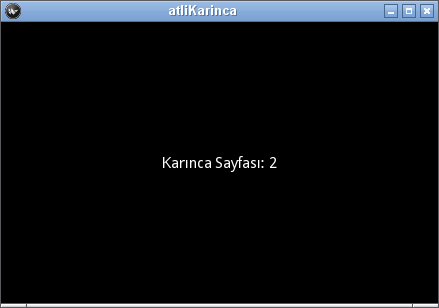
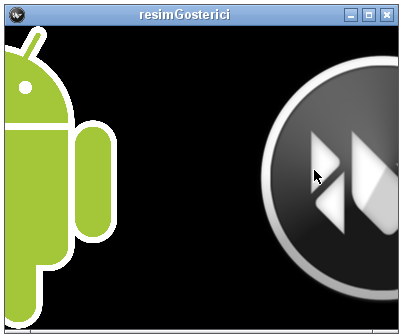
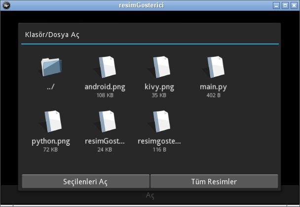
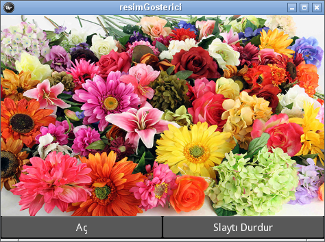
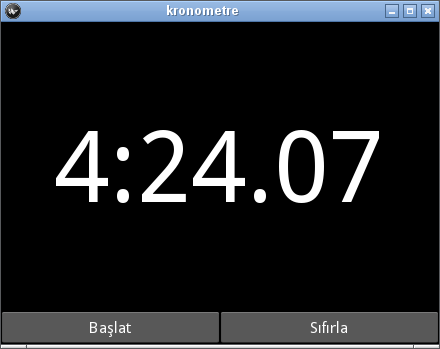

.. _resimGostericiBolumu:

################################
Atlıkarınca ve Resim Gösterici
################################

Atlı karınca dememizin nedeni ":index:`carousel`" kelimesi İngilizce'de ":index:`atlıkarınca`" anlamını taşıması, 
elbette bir de at yarışlarındaki gösteri turnuvasına denmekte, ancak "carousel" isminin neye dayanarak
verildiğini bilmiyorum (merak etmiyor da değilim, yoksa şu parklarda gördüğümz askıda dönen salıncaklardan
mı geliyor acabağa). Bu "Carousel" denen şey nedir? Cep telefonunuzu
kullanırken, ekranı sağa sola (ya da üste alta) parmaklarınızın ucu ile kaydırıyorsunuz ya, işte o. 
Bu bölümde Corusel (atlıkarınca) kullanarak bir resim gösterici yapmayı planlıyoruz. Normalde
bir resim göstericisini atlıkarınca ile yapmak ne kadar mantıklı bilemiyorum. Çünkü tüm resimleri başta
atlıkarıncaya yüklüyorsunuz. Bu da sanırım bellek kullanımını artırır. Her neyse biz burada bu atlıkarıncayı
nasıl kullanacağımızı öğreneceğiz.

Atlıkarınca (Carousel)
=========================

Atlıkarınca, bir çeşit düzen gibi düşünülebilir. Bu düzen kendi çerisinde çeşitli sekemeleri bulunan ve 
her sekmenin kendi düzeni bulunan bir yapıdır. Sekmeler bir pencerede bulunmaz, kaydırılarak ulaşılırlar.
Burada atlıkarınca sekmelerine sadece etiket (sonraki kesimde resim) koyacağız,
ancak herhengi bir düzen de koyabilirsiniz.

Önce atlıkarıncanın nasıl çalıştığını öğrenelim. Atlıkarınca ``Carousel`` nesnesi ile oluşturulur. 
İstenilen bir düzen (tek bir etiket, tek bir resim ya da diğer düzenler) bu nesneye ``add_widget``
özelliği ile eklenir. :numref:`regimGosterici_main1`'deki gibi ``main.py`` dosyasını  yazalım.

.. literalinclude:: ./programlar/resimGosterici/1/main.py
    :linenos:
    :tab-width: 4
    :caption: main.py
    :name: regimGosterici_main1
    :language: python
    
Bu programı biraz açıklayalım: 10. satırda bir atlıkarınca nesnesi oluşturuluyor. Daha sonra bu karıncaya
5 adet etiket ekleniyor. Her etiketin üzerinde "Karınca Sayfası: 0", "Karınca Sayfası: 1" ... yazmaktadır.
Programı çalıştırıp fare ile sayfayı sola doğru itip bırakın. Bu size sonraki sayfayı görüntüleyecektir.
Mobil cihazlarda, sayfayı parmağınız ile sola doğru itmeniz yeterlidir. Atlıkarıncanın yönü ön tanımlı
olarak sola doğrudur. İsterseniz bunu :index:`direction` özelliği (parametresi) ile değiştirebilirsiniz.
Bu parametrenin (ya da özelliğin) alabileceği değerler şunlardır: right, left, top, bottom. Sanırım bunları
açıklamaya gerek yok. Programın çalışmış halini :numref:`Şekil %s <resimGosterici1Img>`'de görüyorsunuz.

.. _resimGosterici1Img:

   Atlıkarınca

Resim Gösterici
================
Atlıkarıncaya etiket yerine, resim grafik parçacığını eklersek, metin yerine resimleri göstermiş olur.

Bir Klasördeki Resimler
------------------------

Atlıkarıncayı basit olarak, programın bulunduğu dizindeki resimleri gösterecek şekilde kullanmaya çalışalım.
Daha sonra programımızı geliştireceğimizden ``kv`` dilini kullanarak hazırlayalım. Öncelikle ``resimgosterici.kv``
dosyamızı :numref:`regimGosterici_kv1`'deki gibi yazalım.

.. literalinclude:: ./programlar/resimGosterici/2/resimgosterici.kv
    :linenos:
    :tab-width: 4
    :caption: resimgosterici.kv
    :name: regimGosterici_kv1

Buarada anadüzenimizi ``BoxLayout`` yaptık çünkü ilerde düğmeler yerleştireceğiz. Onun dışında bilmediğiniz bir kod
bulunmuyor. Atlıkarıncayı 4. satırdaki ``Carousel`` ile olışturduk. Bu nesneye ulaşmak için id'sini ``karinca`` yaptık.
Bu ``kv`` dosyasını kullanıp, programın çalıştığı klasördeki *png* resimlerini gösterecek ``main.py`` programını da
:numref:`regimGosterici_main2`'deki gibi yazabiliriz.

.. literalinclude:: ./programlar/resimGosterici/2/main.py
    :linenos:
    :tab-width: 4
    :caption: main.py
    :name: regimGosterici_main2
    :language: python

Bu programda ``os.listdir()`` ile bulunduğumuz klasördeki (``os.getcwd()`` ile alınıyor) dosylara üzerinde bir iterasyon
yapılıyor (11. satır). İterasyon içerisinde ``os.path.splitext()`` ile dosyaların (dosya_adı, uzantisi) şeklinde
ayrılıyor ve uzantısı *.png* olan dosyalardan bir :index:`resim` nesnesi oluşturuluyor. Resim nesnesi :index:`Image`
sınıfı ile oluşturulur. Bu sınıfa :index:`source` paramteresi ile oluşturulacak resmin tam dosya adı (yada programın
çalıştığı klasördeki dosya adı) verilir. Oluşturulan ``resim`` nesnesi atlıkarıncanın ``add_widget`` özelliği
ile ekleniyor. Ben programın çalıştığı klasöre Kivy, Android ve Python logolarını koydum 
(umarım telif haklarını ihlal etmemişimdir). Programı çalıştırıp resmi sürüklerken ekran görüntüsünü aşağıdaki
(:numref:`Şekil %s <resimGosterici2Img>`) gibi aldım.

.. _resimGosterici2Img:

   
   Basit Resim Gösterici (kaydırırken)

Bir klasördeki resimleri dosyaların uzantılarına bakarak belirlemek deyim yerinde ise amele işi (burada ameleleri
küçümsemek gibi bir niyetimin olmadığını belirteyim), çünkü onlarda resim formatı var.
Bunun yerine bir dosyanın resim olup olmadığını, Python'un ``imghdr`` modülünü kullanarak anlayabiliriz. Bu modülün
``what`` özelliği resim dosyasının tipini döndürür. Dosya resim değil ise hiçbirşey döndürmez. O Halde programımızı
:numref:`regimGosterici_main3`'deki gibi güncelleyebiliriz.

.. literalinclude:: ./programlar/resimGosterici/3/main.py
    :linenos:
    :tab-width: 4
    :caption: main.py
    :name: regimGosterici_main3
    :language: python

Programın 2. satırında ``imghdr`` modülünü içerdiğimize dikkat edin.

Atlıkarıncaya resimleri ``build()`` altında eklemek mantıklı olmayacaktır. Çünkü ilerde çeşitli yollarla resim ekleyeceğiz
her seferinde aynı işlemleri yapmamız gerekecek. Bunun yerine bir işlev yazalım ve resimleri orada ekleyelim. İşlevimiz
kendisine bir liste halinde gelen dosyaları atlıkarıncaya eklesin. Eğer resimler programın çalıştığı dizin değil de 
(muhtemel olmayacak) başka bir yerde ise o zaman resimlerin tam patikasını vermek gerekecek. 
Bunu :numref:`regimGosterici_main4`''de 17. satırda kolayca yaptık.

.. literalinclude:: ./programlar/resimGosterici/4/main.py
    :linenos:
    :tab-width: 4
    :caption: main.py
    :name: regimGosterici_main4
    :language: python

Burada ``resimleriEkle()`` işlevinde kullandığımız atlıkarıncanın :index:`clear_widgets` özelliği, daha önce eklenmiş tüm
nesneleri (burada resimler) temizlemek içindir. Bu satırı yazmadığımız taktirde önceki resimler de görünecektir. Ayrıca,
``os.path.isfile(dosya)`` kontrolü ile, seçilen klasörde bir başka lat klasör var ise, buna ait resim tipi kontrolünün
yapılmamasını sağladık.

Burada 19. satırı şu şekilde de yazabilirdiniz:

::

    dosyalar=[]
    for x in os.listdir(self.son_patika):
        dosyalar.append(os.path.join(self.son_patika, x))
        
Önceki yazdığımız daha kısa olmalı.

Klasörü Seçme
--------------

Resimler çoğu zaman, önceden belirlenen bir klasör yerine, kullanıcının programı çalıştırdıktan 
sonra seçeceği bir klasörde bulunacaktır. Bunu daha önce :ref:`metinDuzenleyiciBolumu` 'de yapmıştık.
Bunun için `FileChooserListView`` i kullanabiliriz. Fakat burada bir değişiklik yapalım ve `index:`FileChooserIconView`
kullanalım. İkisinin de kullanımı benzer, sadece görüntüleri farklı. ``FileChooserIconView`` dosya ve klasörleri
görüntülerken liste, değil simgelerle göstermektedir. Bu grafik parçacığını ``kv`` dosyasındaki bir form içerisinde
kullanacağız. İlk olarak :numref:`regimGosterici_kv1` daki ``resimgosterici.kv`` dosyasına aşağıdaki kodları ekleyin:

.. literalinclude:: ./programlar/resimGosterici/5/acForm.kv
    :linenos:
    :tab-width: 5
    :caption: acForm
    :name: regimGosterici_acForm

    
Burada farklı olarak :index:`multiselect` özelliğinin değerini ``True`` yaptığımızı görüyorsunuz. Bu, kullanıcının
birden fazla dosyayı seçebilmesine olanak tanıyacaktır. Bu ``kv`` formunu kullanacak sınıfı tanımlamak gerekiyor. Bunu ``class resimGosterici(App)`` satırından önce aşağıdaki
kodları ekleyerek yapabiliriz:

::

  class acForm(Popup):
      pass
      
``main.py`` programında bu sınıfı tanımlamadan önce aşağıdaki gibi ``Popup``'ı içermeyi unutmayın.

::

    from kivy.uix.popup import Popup

Yeni formumuzu açabilmek için ana pencerede bir düğme koymalıyız, ki bu formu açsın. Bunu ``resimgosterici.kv`` 
dosyasındaki ``resimGosterici`` formunu aşağıdaki gibi düzenleyerek yapabiliriz:

::

    <resimGosterici>:
    BoxLayout:
        orientation: "vertical"
        Carousel:
            size_hint_y: 90
            id: karinca

        BoxLayout:
            size_hint_y: 10
            Button:
                text: "Aç"
                on_press: app.klasorAc()

Buarada ``klasorAc()`` işlevi ile ``acForm``'u açacağız. İkinci bir ``BoxLayout`` eklememizin nedeni ilerde başka
düğmeleri de koyacağımızdır. Önce düğmeye tıklandığında formun açılabilmesi için ``build()`` den önce aşağıdaki
işlevi yazalım:

::

    def klasorAc(self):
        form=acForm()
        form.open()

Ana penceredeki "Aç" düğmesine tıklandığında :numref:`Şekil %s <resimGosterici12mg>`'deki gibi açılacaktır.

.. _resimGosterici12mg:

   
   Dosya veya Klasör Seçimi
   
Önce tüm resimleri gösterebilmesi için , ``tumResimler()`` işlevini yazalım. Aşağıdaki işlevi ``build()`` den hemen önce yazın:

::

    def tumResimler(self, kok):
        self.son_patika=kok.ids.dosya_secim.path
        dosyalar=[ os.path.join(self.son_patika, x) for x in os.listdir(self.son_patika) ]
        self.resimleriEkle(dosyalar)

Sanırım bu işlevdeki her satır sizin için anlaşılır. Yaptığımız tek şey ``son_patika`` değişkenine, ``FileChooserIconView`` nesnesinden
``dosya_secim.path`` değerini atamak oldu. Eğer bir resmi tüm tuvale :index:`genişletmek` istiyorsanız, resim nesnesinin :index:`allow_stretch`
özelliğini ``True`` yapmalısınız. Bunu yaptığınızda :index:`en-boy oranı` yine de korunacaktır. En-boy oranının da tuval'e eşitlenmesiniz
istiyorsanız resim nesnesinin :index:`keep_ratio` özelliğini ``False`` yapmanız gerekmektedir. Bunlar için ``resimleriEkle()``
işlevindeki ``resim=Image(source=dosya)`` satırından sonra şu satırları ekleyebilirsiniz:

::

    resim.allow_stretch=True
    resim.keep_ratio=False
    
Bu satırları eklediğimizde açılan resimler tüm tuval'i kaplayacaktır. Şimdide sadece seçilen resimleri göstermek üzere
``secilenResimler()`` işlevini yazalım. Aşağıdaki işlevi ``build()`` den hemen önce yazalım:

::

    def secilenResimler(self, kok):
        self.son_patika=kok.ids.dosya_secim.path
        dosyalar=kok.ids.dosya_secim.selection
        self.resimleriEkle(dosyalar)

Öncekinden daha kolay oldu, sadece ``son_patika`` yı belirlemek ve dosyaları almak oldu. Dikkat edersenin seçilen dosyalar ile
patikayı birleştirmedik, çünkü ``FileChooser`` nesnesi seçilen dosyayı patikası ile birlikte verir.

Programımız burada bitti, ancak kullanıcların istekler sonsuzdur. Bir programı yazmaya başlarken sadece temel ihtiyaçları
göz önünde bulundurarak başlarız. Sonra aklımıza gelen eklentileri ya da kullanıcıların uygulanabilir makul isteklerini
ekleriz. Şöyle bir şey aklımıza gelse "Slay gösterisi". Gelin şimdi bunu yapalım.

Zamanlayıcı ve Slayt Gösterisi
==============================

Slayt gösterisini yapabilmek için, :index:`zamanlayıcı` ya (:index:`timer`) ihtiyacımız var. Neden mi? Eğer resimler arası
geçiş zamanını ``time.sleep()`` ile ayarlarsanız, döngü bitene kadar program ile etkileşim yapılamaz. Bu nedenle zamanlayıcıya
ihtiyacımız var. Zamanlayıcıyı program içerisinde çalışan bir saat olarak düşünebilirsiniz. Bu saat her tık atışında bir işlevi
çağırır ve sizde bu işlevde yapılması gerekenleri kodlarsınız. Öncelikle ekranın en altına slayt gösterisini başlatıp
durdurabileceğimiz bir düğme ekleyelim. Bunu ``kv`` dosyasındaki ``<resimGosterici>`` formunun altındaki ``BoxLayout`` düzenine
aşağıdaki satırları ekleyerek yapabiliriz:

::

        Button:
            id: slyat_dugme
            text: "Slaytı Başlat"
            on_press: app.slaytGosterisi(root)

Eğer hiç resim yüklenmediyse, bu düğmeyi pasifleştirmek gerekir. Kivy'de bir nesneyi :index:`pasifleştirmek` için ``disabled``
özelliğine ``Treu`` ataması yaparız. Ön tanımlı olarak nesnelerin ``disabled`` özelliği ``False`` konumundadır.
O halde öncelikle ``build()`` işlevinin en sonuna aşağıdaki satırı ekleyelim:

::

    self.root.ids.slyat_dugme.disabled=True
    
Böylelikle, program başladığında atlıkarıncada hiç resim olmayacağından, diğme :index:`etkin` olmayacaktır.
Bir de, ``resimleriEkle()`` işlevinin en altına aşağıdaki satırları eklemeliyiz:

::

        if self.root.ids.karinca.slides:
            self.root.ids.slyat_dugme.disabled=False
        else:
            self.root.ids.slyat_dugme.disabled=True

Nedenini şöyle açıklayalım. Herhangi bir düğmeye tıklayarak, atlıkarıncaya resim eklenmişse, ``self.root.ids.karinca.slides``
değeri ``None`` dan farklı olacaktır ve düğme etkinleşecektir aksi halde düğme pasif olacaktır.

Slayt gösterisi için zamanlayıcıya ihtiyacımız olduğunu söyledik, bunun için kivy modüllerini içerdiğimiz satırların sonuna
şu satırı ekleyelim:

::

    from kivy.clock import Clock

``<resimGosterici>`` formuna eklediğimiz ``id`` si ``slyat_dugme`` olan düğmeye tıklandığında ``slaytGosterisi()``
işlevi çağrılacaktır. Şim bunu ``build()`` den hemen önce şu şekilde yazalım:

::

    def slaytGosterisi(self, kok):
        if kok.ids.slyat_dugme.text=="Slaytı Başlat":
            Clock.schedule_interval(self.zamanlayiciIslevi, 1)
            kok.ids.slyat_dugme.text="Slaytı Durdur"
        else:
            Clock.unschedule(self.zamanlayiciIslevi)
            kok.ids.slyat_dugme.text="Slaytı Başlat"

Bu işleve başlarken, slayt gösterisi devam ediyor mu etmiyor mu onu kontrol ederek başladık. Bunu ``slyat_dugme`` nin üzerindeki
metni kullanarak kontrol ettik. Eğer düğme metni "Slaytı Başlat" ise, slayt başlamamıştır ve bu blokta slaytı başlatıyoruz.
Slaytı başlatmak için saatin (Clock) tik atış aralığını veriyoruz. Bunu :index:`Clock` nesnesinin :index:`schedule_interval`
özelliği ile yaparız. Zamanlayıcı şu şekilde başlatılır:

*Clock.schedule_interval(islev, atis_zaman_araligi)*

Burada *islev* her tık attığında çağrılacak işlevi ve *zaman_araligi* tik aralıklarını saniye cinsinden ifade etmektedir.
Programımızda her tık atışta ``zamanlayiciIslevi()`` çağrılacaktır. Tık aralıkları ise 1 saniye olarak verilmiştir.
Zamanlayıcı (daha doğrusu slayt gösterisi) başladıktan sonra, ``slyat_dugme`` nin üzerindeki metni "Slaytı Durdur"
olarak değiştiriyoruz. Böylelikle aynı düğme salytı hem başlatmak hem de durdurmak için kullanılıyor.

Zamanlayıcı şu şekilde durdurulur:

*Clock.unschedule(islev)*

Zamanlayıcı ayrı işlevleri çağırmak için planlanabilir (schedule edilebilir) ve her seferinde *isev* ile *atis_zaman_araligi*
farklı olabilir. Planlanmış bir zamanlayıcıyı durdurmak için :index:`unschedule` özelleğini kullanıyoruz.

Buradan anlaşılacağı gibi slayt gösterisini yapacak işlevin çağrılmasını durdurmak için (planı bozmak için):
``Clock.unschedule(self.zamanlayiciIslevi)`` satırını kullandık ve hemen sonrasında ``slyat_dugme`` nin üzerindeki metni
"Slaytı Başlat" yaptık.

Şimdide salyat gösterini yapacak olan ``zamanlayiciIslevi()`` işlevini yazalım. Bu işlev zamanlayıcının her tik atışında
çağrılacaktır. Her çağrılışta atlı karıncanın bir sonraki slaytını göstermesi gerekir. Atlıkarıncanın sonraki slaytı göstermesi
için :index:`load_next` işevini kullanırız (önceki için :index:`load_previous``). Zamanlayıcı işlevini ``slaytGosterisi()`` nden
önce aşağıdaki gibi yazabiliriz:

::

    def zamanlayiciIslevi(self, za):
        self.root.ids.karinca.load_next()

Zamanlayıcı işlevi çağırırken ilk argüman olarak, iki tik atışltaki zaman aralığını verir (belki programcının bunu
kullanmaya ihtiyacı olabilir), bunu işlevimizde ``za`` olarak aldık.

Slayt gösterisi bittiğinde (en son resme gelindiğinde), sonraki resim gösterileyemecektir ve sürekli aynı resimde atlam olacaktır.
Eğer atlıkarıncanın sonsuz döngüde (sona geldiğinde tekrar başa sarma) çalışmasını istiyorsanız :index:`loop` özelliğini ``True``
yapmalısınız. Programımızda ``build()`` işlevinin başına aşağıdaki satırı ekleyerek sonsuz döngüye sokmuş oluruz:

:: 
    
    self.root.ids.karinca.loop=True

Son durumda programımızın penceresi :numref:`Şekil %s <resimGosterici5img>`'deki gibi açılacaktır.

.. _resimGosterici5img:

  Slayt Gösterici

Anlattıklarımızı takip edemediyseniz, yada ben yaptıklarımı gözden kaçırıp eksik yazmışsam,
bu bölümde anlattıklarımı yaptığım dosyaları şu adreslerden alabilirsiniz:

main.py: https://github.com/mbaser/kivy-tr/blob/master/docs/programlar/resimGosterici/5/main.py

metinduzenleyici.kv: https://github.com/mbaser/kivy-tr/blob/master/docs/programlar/resimGosterici/5/resimgosterici.kv

Kronometre Uygulaması
=====================

Zamanlayıcı kullanarak bir :index:`kronometre` yapınız. Kronometrede iki düğme bulunmalıdır: *Başlat* ve *Sıfırla*
*Başlat* düğmesine tıklanınca kronomtere başlayacak ve üzerindeki metin *Durdur* olacaktır. *Sıfırla* düğmesine
tıklanınca kronometre sıfırlanacaktır. Kronometre tıklama aralığı 0.1 saniye olacaktır. Etiketteki metnin büyüklüğünü
100 piksel yapınız. Bir etiketin yazıtipi büyüklüğünü :index:`font_size` özelliği ile ayarlayabilirsiniz.

Kronometreniz çalıştığında :numref:`Şekil %s <resimGosterici6img>`'deki gibi bir pencere olacaktır.

.. _resimGosterici6img:

  Kronometre

Çözüm:

main.py: https://github.com/mbaser/kivy-tr/blob/master/docs/programlar/resimGosterici/kronometre/main.py

kronometre.kv: https://github.com/mbaser/kivy-tr/blob/master/docs/programlar/resimGosterici/kronometre/kronometre.kv

